# Dashboard UI Documentation

## Overview

The `GlowSoftDashboard` component (located at `app/test/bento.tsx`) is the main dashboard interface for Glow. It features a **section-based vertical layout** that adapts its content based on the user's wallet connection status, providing a streamlined experience for new users while offering comprehensive tools for connected users.

### Important: Not Actually a Bento Grid

**Despite the file name `bento.tsx`, this is NOT a bento grid layout.** The dashboard has evolved from an earlier bento grid design into a **section-based vertical layout with themed groupings**.

The current architecture uses:

- Vertical sections with semantic headings (e.g., "Mining & Rewards")
- Single cards per section containing multiple widgets
- Internal dividers (`divide-x`, `divide-y`) instead of grid gaps
- Content-driven auto-height instead of fixed grid cells

**Why the name persists:** The file name is historical and hasn't been renamed to avoid breaking references and routes.

## Layout Architecture

The dashboard uses **thematic sections** where each section is a single card containing multiple widgets separated by dividers (not individual grid cells). The core behavior is controlled by one derived value:

- **`hasWallet`**: `Boolean(walletAddressOverride ?? connectedAddress ?? null)` — true when we have a wallet address (connected wallet or override), otherwise false
- **`walletAddress`**: `walletAddressOverride ?? connectedAddress ?? null` — the actual wallet address to use (supports viewing other wallets via override)

## Visual Layout Guide (ASCII)

### Connected State - Empty Wallet (Zero GLW, No Activity)

```
┌─────────────────────────────────────────────────────────────────────┐
│ DASHBOARD HEADER BAND                                               │
├──────────────────────┬────────────────────────────┬─────────────────┤
│ RankWidget (hero)    │ OnboardingHeroWidget       │ WalletWidget    │
│ ┌──────────────────┐ │ ┌────────────────────────┐ │ ┌─────────────┐ │
│ │ Impact Score     │ │ │ New to Glow?           │ │ │ Your Wallet │ │
│ │ [BLURRED]        │ │ │ Start Here             │ │ │ GLW: 0.00   │ │
│ │ Connect wallet   │ │ │                        │ │ │ ETH: 0.15   │ │
│ │ to see rank      │ │ │ "$20 of GLW..."        │ │ │ USDC: 0.00  │ │
│ └──────────────────┘ │ │ [Buy GLW Button]       │ │ │ USDG: 0.00  │ │
│                      │ └────────────────────────┘ │ └─────────────┘ │
└──────────────────────┴────────────────────────────┴─────────────────┘

┌─────────────────────────────────────────────────────────────────────┐
│ MINING & REWARDS                                                    │
├───────────────────────────────────────────┬─────────────────────────┤
│ SolarFarmWidget (minimal)                 │ RewardsWidget (minimal) │
│ ┌───────────────────────────────────────┐ │ ┌─────────────────────┐ │
│ │ Glow Mining                           │ │ │ Rewards             │ │
│ │                                       │ │ │                     │ │
│ │ [EMPTY STATE]                         │ │ │ Available: 0 GLW    │ │
│ │ No Active Solar Streams               │ │ │                     │ │
│ │                                       │ │ │ [No Rewards]        │ │
│ │ • How Mining Works                    │ │ │ (disabled button)   │ │
│ │ • Guide to Delegation                 │ │ │                     │ │
│ │                                       │ │ │                     │ │
│ │ [Browse Launchpad or Countdown]       │ │ │                     │ │
│ └───────────────────────────────────────┘ │ └─────────────────────┘ │
└───────────────────────────────────────────┴─────────────────────────┘

┌─────────────────────────────────────────────────────────────────────┐
│ GROW YOUR IMPACT                                                    │
├───────────────────────────────────────────┬─────────────────────────┤
│ LaunchpadStatusWidget (minimal)           │ GctlHeatmapWidget       │
│ ┌───────────────────────────────────────┐ │ ┌─────────────────────┐ │
│ │ [IF LIVE: Educational Cards]          │ │ │ Glow Control (GCTL) │ │
│ │ Guide to Delegation [Learn more →]   │ │ │                     │ │
│ │ How Miners Work [Learn more →]       │ │ │ [EMPTY STATE]       │ │
│ │                                       │ │ │ Direct Global       │ │
│ │ [IF NOT LIVE: Countdown]              │ │ │ Emissions           │ │
│ │ New Solar Farm Listing In...          │ │ │                     │ │
│ │ X days XX:XX:XX                       │ │ │ +3 pts per GLW      │ │
│ │                                       │ │ │                     │ │
│ │ GLW Price: $X.XX [defined.fi]         │ │ │ [Mint & Stake GCTL] │ │
│ └───────────────────────────────────────┘ │ └─────────────────────┘ │
└───────────────────────────────────────────┴─────────────────────────┘

┌─────────────────────────────────────────────────────────────────────┐
│ YOUR JOURNEY                                                        │
├─────────────────────┬──────────────────────────┬────────────────────┤
│ WeeklyActivity      │ RecentActivity (minimal) │ PortfolioSummary   │
│ ┌─────────────────┐ │ ┌──────────────────────┐ │ ┌────────────────┐ │
│ │ Weekly Streak   │ │ │ Recent Activity      │ │ │ Mining Summary │ │
│ │ [BLURRED GRID]  │ │ │                      │ │ │                │ │
│ │ Connect wallet  │ │ │ (Not shown when      │ │ │ (Not shown)    │ │
│ │                 │ │ │  hideIfEmpty=true)   │ │ │                │ │
│ └─────────────────┘ │ └──────────────────────┘ │ └────────────────┘ │
├─────────────────────┴──────────────────────────┴────────────────────┤
│ My Farms                                                            │
│ ┌─────────────────────────────────────────────────────────────────┐ │
│ │ [EMPTY STATE]                                                   │ │
│ │ No farms to display                                             │ │
│ └─────────────────────────────────────────────────────────────────┘ │
└─────────────────────────────────────────────────────────────────────┘
```

### Connected State - Full Wallet (Active Positions & History)

```
┌─────────────────────────────────────────────────────────────────────┐
│ [OPTIONAL: LAUNCHPAD LIVE - Full width when active]                │
│ LaunchpadStatusWidget (variant="full-row")                          │
│ ┌─────────────────────────────────────────────────────────────────┐ │
│ │ Glow Launchpad                           [Buy GLW Button]       │ │
│ │ [All] [Delegations] [Miners] [Activity]                         │ │
│ │                                                                  │ │
│ │ [Carousel of available farms with deposit actions]              │ │
│ └─────────────────────────────────────────────────────────────────┘ │
└─────────────────────────────────────────────────────────────────────┘

┌─────────────────────────────────────────────────────────────────────┐
│ DASHBOARD HEADER BAND                                               │
├──────────────────────┬────────────────────────────┬─────────────────┤
│ RankWidget (hero)    │ NetWorthWidget (minimal)   │ WalletWidget    │
│ ┌──────────────────┐ │ ┌────────────────────────┐ │ ┌─────────────┐ │
│ │ Impact Score     │ │ │ Glow Worth             │ │ │ Your Wallet │ │
│ │                  │ │ │ 1,234.56 GLW           │ │ │             │ │
│ │ 15,432 pts       │ │ │                        │ │ │ GLW: 523.45 │ │
│ │                  │ │ │ +12.34 this week       │ │ │ ETH: 0.15   │ │
│ │ Rank: #153       │ │ │                        │ │ │ USDC: 45.00 │ │
│ │ Top 5%           │ │ │ [13-week chart ──╱─]   │ │ │ USDG: 12.50 │ │
│ │                  │ │ │                        │ │ │             │ │
│ │ [🔶🔥⚡💰🏦💎]    │ │ │ [Breakdown] [Chart]    │ │ │ [Swap][Send]│ │
│ └──────────────────┘ │ └────────────────────────┘ │ └─────────────┘ │
└──────────────────────┴────────────────────────────┴─────────────────┘

┌─────────────────────────────────────────────────────────────────────┐
│ MINING & REWARDS                                                    │
├───────────────────────────────────────────┬─────────────────────────┤
│ SolarFarmWidget (minimal)                 │ RewardsWidget (minimal) │
│ ┌───────────────────────────────────────┐ │ ┌─────────────────────┐ │
│ │ Glow Mining          [View Details]   │ │ │ Rewards             │ │
│ │                                       │ │ │                     │ │
│ │ Current Weekly Payout                 │ │ │ Next claim in:      │ │
│ │ 42.5 GLW + 15.2 USDG                  │ │ │ 2d 14h 23m          │ │
│ │                                       │ │ │                     │ │
│ │ [Active: 2 miners, 5 delegations]     │ │ │ Available Now:      │ │
│ │                                       │ │ │ 125.45 GLW          │ │
│ │ [10-week stacked bar chart]           │ │ │ 38.20 USDG          │ │
│ │ ████▓▓▓▓░░  (Y/P/G/O bars)            │ │ │                     │ │
│ │                                       │ │ │ [Claim Rewards]     │ │
│ └───────────────────────────────────────┘ │ └─────────────────────┘ │
└───────────────────────────────────────────┴─────────────────────────┘

┌─────────────────────────────────────────────────────────────────────┐
│ GROW YOUR IMPACT                                                    │
├───────────────────────────────────────────┬─────────────────────────┤
│ LaunchpadStatusWidget (minimal)           │ GctlHeatmapWidget       │
│ ┌───────────────────────────────────────┐ │ ┌─────────────────────┐ │
│ │ [IF LIVE: Educational Cards]          │ │ │ Glow Control [Boost]│ │
│ │ 🟣 Guide to Delegation                │ │ │                     │ │
│ │    [Learn more →]                     │ │ │ My Holdings:        │ │
│ │                                       │ │ │ 1,500 GCTL          │ │
│ │ 🟠 How Miners Work                    │ │ │ (1,200 active)      │ │
│ │    [Learn more →]                     │ │ │                     │ │
│ │                                       │ │ │ Steering Score:     │ │
│ │ [ELSE: Countdown Display]             │ │ │ 8,432 pts           │ │
│ │ New Solar Farm Listing In...          │ │ │                     │ │
│ │ X days XX:XX:XX                       │ │ │ Active Stakes:      │ │
│ │ GLW $X.XX [defined.fi]                │ │ │ • USA East: 800 ... │ │
│ │ Have your GLW ready to delegate.      │ │ │ • Kenya: 400 ...    │ │
│ └───────────────────────────────────────┘ │ └─────────────────────┘ │
└───────────────────────────────────────────┴─────────────────────────┘

┌─────────────────────────────────────────────────────────────────────┐
│ YOUR JOURNEY                                                        │
├─────────────────────┬──────────────────────────┬────────────────────┤
│ WeeklyActivity      │ RecentActivity (minimal) │ PortfolioSummary   │
│ ┌─────────────────┐ │ ┌──────────────────────┐ │ ┌────────────────┐ │
│ │ Weekly Streak   │ │ │ Recent Activity      │ │ │ Mining Summary │ │
│ │                 │ │ │                      │ │ │                │ │
│ │ 12 Wks          │ │ │ • Split: Farm #123   │ │ │ Delegated GLW  │ │
│ │                 │ │ │ • Claim: 45.2 GLW    │ │ │ 850.50         │ │
│ │ [24-week grid]  │ │ │ • Swap: 100→95 GLW   │ │ │                │ │
│ │ ▓▓▓▓▓▓░░░░...   │ │ │ • Split: Farm #456   │ │ │ Active Miners  │ │
│ │ (colored cells) │ │ │                      │ │ │ 2              │ │
│ │                 │ │ │ [Expand]             │ │ │                │ │
│ │ Streak: 12/4    │ │ │                      │ │ │ Active Deleg.  │ │
│ └─────────────────┘ │ └──────────────────────┘ │ │ 5              │ │
│                     │                          │ └────────────────┘ │
├─────────────────────┴──────────────────────────┴────────────────────┤
│ My Farms                          [Sort: Default ▼] [Grid View 🔲] │
│ ┌─────────────────────────────────────────────────────────────────┐ │
│ │ ┌─────────────┐ ┌─────────────┐ ┌─────────────┐                │ │
│ │ │ Farm #123   │ │ Farm #456   │ │ Farm #789   │ ...            │ │
│ │ │ [Image]     │ │ [Image]     │ │ [Image]     │                │ │
│ │ │ Miner       │ │ Delegation  │ │ In Progress │                │ │
│ │ │ Kenya       │ │ India       │ │ USA East    │                │ │
│ │ │ 8 wks active│ │ 12 wks      │ │ 60% funded  │                │ │
│ │ └─────────────┘ └─────────────┘ └─────────────┘                │ │
│ └─────────────────────────────────────────────────────────────────┘ │
└─────────────────────────────────────────────────────────────────────┘
```

### Guest State (Not Connected)

```
┌─────────────────────────────────────────────────────────────────────┐
│ [OPTIONAL: LAUNCHPAD LIVE - Full width when active]                │
│ LaunchpadStatusWidget (variant="full-row")                          │
│ ┌─────────────────────────────────────────────────────────────────┐ │
│ │ Glow Launchpad                           [Buy GLW Button]       │ │
│ │ [All] [Delegations] [Miners] [Activity]                         │ │
│ │                                                                  │ │
│ │ [Carousel of available farms - can browse & see details]        │ │
│ └─────────────────────────────────────────────────────────────────┘ │
└─────────────────────────────────────────────────────────────────────┘

┌─────────────────────────────────────────────────────────────────────┐
│ HERO SECTION                                                        │
├───────────────────────────────────────────┬─────────────────────────┤
│ OnboardingHeroWidget (minimal)            │ LaunchpadStatusWidget   │
│ ┌───────────────────────────────────────┐ │ ┌─────────────────────┐ │
│ │ New to Glow? Start Here               │ │ │ [IF LIVE]           │ │
│ │                                       │ │ │ 🟣 Guide to         │ │
│ │ [GLOW Logo Watermark]                 │ │ │    Delegation       │ │
│ │                                       │ │ │ 🟠 How Miners Work  │ │
│ │ "$20 of GLW is a single solar panel   │ │ │                     │ │
│ │  producing carbon neutral power       │ │ │ [ELSE]              │ │
│ │  credits for 6 months"                │ │ │ Listing In...       │ │
│ │                                       │ │ │ X days XX:XX:XX     │ │
│ │ — David Vorick, Founder               │ │ │                     │ │
│ │                                       │ │ │ GLW $X.XX           │ │
│ │ [Buy GLW Button]                      │ │ │ Have GLW ready...   │ │
│ └───────────────────────────────────────┘ │ └─────────────────────┘ │
└───────────────────────────────────────────┴─────────────────────────┘

┌─────────────────────────────────────────────────────────────────────┐
│ COMMUNITY & LEADERBOARD                                             │
├─────────────────────────────────────────────┬───────────────────────┤
│ CommunityActivityWidget (minimal)           │ GlobalLeaderboard     │
│ ┌─────────────────────────────────────────┐ │ ┌───────────────────┐ │
│ │ Latest Launchpad Activity    [Recent]   │ │ │ Impact Leaderboard│ │
│ │                                         │ │ │ [Top 3]           │ │
│ │ • 0x1a2b... deposited 250 GLW on Farm#1 │ │ │                   │ │
│ │ • alice.eth claimed 42.5 GLW            │ │ │ 🥇 alice.eth      │ │
│ │ • 0x3c4d... mined with Farm #456        │ │ │    45,321 pts     │ │
│ │ • bob.eth delegated to Kenya region     │ │ │    Worth: 1.2k    │ │
│ │ • 0x5e6f... swapped USDC → GLW          │ │ │                   │ │
│ │                                         │ │ │ 🥈 bob.eth        │ │
│ │ [See All Activity]                      │ │ │    38,567 pts     │ │
│ │                                         │ │ │    Worth: 980     │ │
│ └─────────────────────────────────────────┘ │ │                   │ │
│                                             │ │ 🥉 carol.eth      │ │
│                                             │ │    35,124 pts     │ │
│                                             │ │    Worth: 875     │ │
│                                             │ │                   │ │
│                                             │ │ [Full Leaderboard]│ │
│                                             │ └───────────────────┘ │
└─────────────────────────────────────────────┴───────────────────────┘

┌─────────────────────────────────────────────────────────────────────┐
│ PROTOCOL METRICS                                                    │
│ ┌─────────────────────────────────────────────────────────────────┐ │
│ │ ┌──────────┐ ┌──────────┐ ┌──────────┐ ┌──────────────────┐    │ │
│ │ │GLW Price │ │Market Cap│ │Delegated │ │ View All Stats   │    │ │
│ │ │$0.0234   │ │$12.3M    │ │45.2%     │ │ [→]              │    │ │
│ │ │[↗]       │ │          │ │of supply │ │                  │    │ │
│ │ └──────────┘ └──────────┘ └──────────┘ └──────────────────┘    │ │
│ │                                                                  │ │
│ │ New Solar Farms & Protocol Deposit (Last 3 Months)              │ │
│ │ [Dual-axis chart: bars=farm count, line=deposit value]          │ │
│ │ ███ ██ ████ ███ ██ ███ ████ ███ ██ ███ ████ ███               │ │
│ │ ────────────────────────────────╱───╲───╱────                   │ │
│ └─────────────────────────────────────────────────────────────────┘ │
└─────────────────────────────────────────────────────────────────────┘

┌─────────────────────────────────────────────────────────────────────┐
│ EDUCATION                                                           │
├───────────────────────────────────────────────┬─────────────────────┤
│ GlowFaqWidget (minimal)                       │ BlogFeaturedWidget  │
│ ┌─────────────────────────────────────────┐   │ ┌─────────────────┐ │
│ │ Glow FAQ                [Documentation] │   │ │ [Blog Image BG] │ │
│ │                                         │   │ │                 │ │
│ │ Questions:        │ Answer:             │   │ │ [Gradient ▼]    │ │
│ │ • What is Glow?  →│ Glow is a          │   │ │                 │ │
│ │ • What is GLW?    │ decentralized...   │   │ │ Progressive     │ │
│ │ • Delegating      │                    │   │ │ Vaults          │ │
│ │ • Miners          │ (Selected answer   │   │ │                 │ │
│ │ • Impact Score    │  displayed here)   │   │ │ Competitive     │ │
│ │                   │                    │   │ │ Deposit...      │ │
│ │                   │                    │   │ │                 │ │
│ │                   │                    │   │ │ [Author info]   │ │
│ │                   │                    │   │ │ [↗]             │ │
│ └─────────────────────────────────────────┘   │ └─────────────────┘ │
└───────────────────────────────────────────────┴─────────────────────┘

┌─────────────────────────────────────────────────────────────────────┐
│ STAY CONNECTED                                                      │
├─────────────────────────────────────┬───────────────────────────────┤
│ NewsletterWidget (minimal)          │ DiscordWidget (minimal)       │
│ ┌─────────────────────────────────┐ │ ┌───────────────────────────┐ │
│ │ Newsletter          ✨          │ │ │ [Discord Purple BG]       │ │
│ │                                 │ │ │ [Giant Discord Logo]      │ │
│ │ [Mail Icon Watermark]           │ │ │                           │ │
│ │                                 │ │ │ ONLINE 🟢                 │ │
│ │ Stay in the loop.               │ │ │                           │ │
│ │                                 │ │ │ Join the conversation     │ │
│ │ Get updates on emissions,       │ │ │ in Discord.               │ │
│ │ rewards, and new farms.         │ │ │                           │ │
│ │                                 │ │ │ 7k+ Members               │ │
│ │ [email@example.com] [→]         │ │ │ 24/7 Community            │ │
│ │                                 │ │ │                    [↗]    │ │
│ └─────────────────────────────────┘ │ └───────────────────────────┘ │
└─────────────────────────────────────┴───────────────────────────────┘
```

### Key Layout Differences

| State                 | Sections                              | Key Widgets                                                             | Primary Goal                    |
| --------------------- | ------------------------------------- | ----------------------------------------------------------------------- | ------------------------------- |
| **Connected - Empty** | 4 core sections                       | OnboardingHeroWidget replaces NetWorthWidget<br/>Empty states with CTAs | Onboard user to first actions   |
| **Connected - Full**  | 4 core sections (+optional Launchpad) | All widgets show live data<br/>Charts, metrics, farm grid               | Manage portfolio & grow         |
| **Guest**             | 5 sections (+optional Launchpad)      | Education-focused widgets<br/>Community activity, FAQ                   | Learn & get inspired to connect |

### Loading States

The dashboard shows three distinct states based on connection status:

1. **`hasWallet === true`**: Shows connected dashboard (sections described below)
2. **`isWalletSettling === true`**: Shows `DashboardConnectingSkeleton` during wallet connection
   - Condition: `isMounted && !walletAddressOverride && !hasWallet && (isConnecting || isReconnecting) && !hasAnyDialogOpen`
   - Displays placeholder skeleton grid mimicking the expected layout
3. **`hasWallet === false`**: Shows guest dashboard (sections described below)

All three states are wrapped in `AnimatePresence` with `mode="wait"` for smooth transitions.

### Connected state

When `hasWallet = true`, the dashboard shows these vertical sections:

#### Optional Section 0: Launchpad Live/Approaching

- **`LaunchpadStatusWidget(variant="full-row")`** — full-width section, only shown when:
  - Launchpad is live with available listings, OR
  - Launchpad opens within 1 hour
- Section header: "Launchpad Live" or "Launchpad Opening Soon"

#### Section 1: Dashboard Header Band

- Single card containing three widgets in a horizontal row (divided by vertical dividers):
  - `RankWidget(variant="hero")` — Impact Score (lg:col-span-3)
  - `NetWorthWidget(variant="minimal")` — Glow Worth + chart (lg:col-span-5)
  - `WalletWidget(variant="minimal")` — Holdings + Swap/Send (lg:col-span-2)
- Uses `grid-cols-1 lg:grid-cols-10` with `divide-x` on desktop

#### Section 2: Mining & Rewards

- Section header: "Mining & Rewards"
- Single card containing two widgets (divided):
  - `SolarFarmWidget(variant="minimal")` — performance + chart (lg:col-span-2, lg:pr-8)
  - `RewardsWidget(variant="minimal")` — claimable + countdown (lg:pl-8)
- Uses `grid-cols-1 lg:grid-cols-3` with `divide-x divide-y lg:divide-y-0`

#### Section 3: Grow Your Impact

- Section header: "Grow Your Impact"
- Single card containing two widgets (divided):
  - `LaunchpadStatusWidget(variant="minimal")` — listings or countdown (lg:pr-8)
  - `GctlHeatmapWidget(variant="minimal")` — steering control (lg:pl-8)
- Uses `grid-cols-1 lg:grid-cols-2` with `divide-x divide-y lg:divide-y-0`

#### Section 4: Your Journey

- Section header: "Your Journey"
- Single card with two sub-sections:
  1. **Top sub-section** (three widgets in divided row):
     - `WeeklyActivityWidget(variant="minimal")` (lg:col-span-4)
     - `RecentActivityWidget(variant="minimal")` (lg:col-span-5)
     - `PortfolioSummaryWidget(variant="minimal")` (lg:col-span-3)
     - Divided with `divide-x divide-y lg:divide-y-0`
     - Bottom border: `border-b border-border/50`
  2. **My Farms sub-section**:
     - Heading: "My Farms"
     - `MyFarmsGridSection` — full farm grid with view modes

### Guest state

When `hasWallet = false`, the dashboard shows these onboarding-focused sections (no blurred/locked widgets):

#### Optional Section 0: Launchpad Live/Approaching

- Same as connected state - **`LaunchpadStatusWidget(variant="full-row")`**

#### Section 1: Hero Section

- Single card containing two widgets (divided):
  - `OnboardingHeroWidget(variant="minimal")` — value prop + Buy GLW CTA (lg:col-span-1)
  - `LaunchpadStatusWidget(variant="minimal")` — listings or countdown (lg:col-span-1)
- Uses `grid-cols-1 lg:grid-cols-2` with `divide-y lg:divide-y-0`

#### Section 2: Community & Leaderboard

- Section header: "Community & Leaderboard"
- Single card containing two widgets (divided):
  - `CommunityActivityWidget(variant="minimal")` — recent activity feed (lg:col-span-8)
  - `GlobalLeaderboardWidget(variant="minimal")` — top 3 leaderboard (lg:col-span-4)
- Uses `grid-cols-1 lg:grid-cols-12` with `divide-x divide-y lg:divide-y-0`

#### Section 3: Protocol Metrics

- Section header: "Protocol Metrics"
- Single card (no internal division):
  - `ProtocolMetricsWidget` — metrics cards + chart
- Full width, no grid divisions

#### Section 4: Education

- Section header: "Education"
- Single card containing two widgets (divided):
  - `GlowFaqWidget(variant="minimal")` — FAQ accordion (lg:col-span-7)
  - `BlogFeaturedWidget` — featured article (lg:col-span-5)
- Uses `grid-cols-1 lg:grid-cols-12` with `divide-x divide-y lg:divide-y-0`

#### Section 5: Stay Connected

- Section header: "Stay Connected"
- Single card containing two widgets (divided):
  - `NewsletterWidget(variant="minimal")` — email signup (lg:col-span-5)
  - `DiscordWidget(variant="minimal")` — Discord invite (lg:col-span-7)
- Uses `grid-cols-1 lg:grid-cols-12` with `divide-x divide-y lg:divide-y-0`

### Flow overview (connected vs guest)

```mermaid
flowchart TD
  hasWallet{hasWallet?}

  hasWallet -->|false| guest[Guest Dashboard]
  hasWallet -->|true| connected[Connected Dashboard]

  guest --> HeroSection["Hero Section"]
  guest --> CommunitySection["Community & Leaderboard"]
  guest --> ProtocolSection["Protocol Metrics"]
  guest --> EducationSection["Education"]
  guest --> StayConnectedSection["Stay Connected"]

  HeroSection --> OnboardingWidget["OnboardingHeroWidget"]
  HeroSection --> LaunchpadGuest["LaunchpadStatusWidget"]
  CommunitySection --> CommunityWidget["CommunityActivityWidget"]
  CommunitySection --> LeaderboardWidget["GlobalLeaderboardWidget"]
  ProtocolSection --> ProtocolWidget["ProtocolMetricsWidget"]
  EducationSection --> FAQWidget["GlowFaqWidget"]
  EducationSection --> BlogWidget["BlogFeaturedWidget"]
  StayConnectedSection --> NewsletterWidget["NewsletterWidget"]
  StayConnectedSection --> DiscordWidget["DiscordWidget"]

  connected --> HeaderSection["Dashboard Header Band"]
  connected --> MiningSection["Mining & Rewards"]
  connected --> ImpactSection["Grow Your Impact"]
  connected --> JourneySection["Your Journey"]

  HeaderSection --> RankWidget["RankWidget"]
  HeaderSection --> NetWorthWidget["NetWorthWidget"]
  HeaderSection --> WalletWidget["WalletWidget"]
  MiningSection --> SolarWidget["SolarFarmWidget"]
  MiningSection --> RewardsWidget["RewardsWidget"]
  ImpactSection --> LaunchpadWidget["LaunchpadStatusWidget"]
  ImpactSection --> GctlWidget["GctlHeatmapWidget"]
  JourneySection --> WeeklyWidget["WeeklyActivityWidget"]
  JourneySection --> RecentWidget["RecentActivityWidget"]
  JourneySection --> PortfolioWidget["PortfolioSummaryWidget"]
  JourneySection --> FarmsGrid["MyFarmsGridSection"]
```



## Layout Patterns

### Section Structure

Each section follows this pattern:

```tsx
<section className="flex flex-col gap-4">
  {/* Optional section header */}
  <SectionHeader title="Section Name" />

  {/* Single card container */}
  <div className="rounded-2xl bg-card dark:bg-muted/20 border border-border/50 p-6 lg:p-8">
    {/* Grid with dividers for widgets */}
    <div className="grid grid-cols-1 lg:grid-cols-N gap-6 lg:gap-0 divide-y lg:divide-y-0 lg:divide-x divide-border/50">
      <div className="pb-6 lg:pb-0 lg:pr-8">
        <WidgetComponent variant="minimal" />
      </div>
      <div className="pt-6 lg:pt-0 lg:pl-8">
        <WidgetComponent variant="minimal" />
      </div>
    </div>
  </div>
</section>
```

### Key Layout Principles

1. **Sections not grids**: Each thematic grouping is a `<section>` with a single card
2. **Dividers not gaps**: Widgets within a card are separated by `divide-x` (desktop) and `divide-y` (mobile)
3. **Padding for spacing**: Divider-adjacent widgets use `lg:pr-8`/`lg:pl-8` for internal spacing
4. **Mobile stacking**: All sections use `flex-col` or `grid-cols-1` on mobile, expanding to multi-column on `lg`
5. **Auto-height**: No fixed heights - sections expand based on content
6. **Minimal variants**: Most widgets receive `variant="minimal"` for transparent backgrounds

### Shared Dialogs & Cross-Widget Interactions

The dashboard container owns several shared dialogs:

- **`MintAndStakeGctlDialog`**: Opened by:
  - `RankWidget` → "Mint & Stake GCTL" or "Rank Up" button
  - `GctlHeatmapWidget` → empty state CTA or "Boost" button
  - Passed to widgets via `onMintAndStakeClick` callback with optional `forceStep1` parameter
- **`DepositDialog`**: Opened by:
  - `LaunchpadStatusWidget` → "Pay Deposit" action on listings
  - Receives application data and reward score for pre-filling
  - Conditionally renders with `selectedCurrency` ("GLW" or "USDC") based on application type
- **`BuyGlowDialog`**: Opened by:
  - `NetWorthWidget` → "Buy GLW" button (when empty state shows OnboardingHeroWidget)
  - `OnboardingHeroWidget` → "Buy GLW" CTA
  - `LaunchpadStatusWidget` → "Buy GLW" button (in header)
  - Defaults to $20 USDC amount (`defaultUsdcAmount="20"`)
- **`RefundClaimsPanel`**: Automatically shown via persistent toast when wallet has refundable fractions
  - Toast shows total refundable amount and count
  - Opens in dialog (`sm:max-w-[980px]`) with `variant="dialog"`
  - Dismisses automatically when no refunds remain
- **`MigrationClaimPanel`**: Automatically shown via persistent toast when wallet has unclaimed GCTL migration
  - Toast shows formatted GCTL amount available to claim
  - Opens in smaller dialog (`sm:max-w-sm`)
  - Handles inline during render (not useEffect) to avoid race conditions
  - Dismisses when migration is claimed or no longer available

## Transitions & Animations

The dashboard uses `framer-motion` for state transitions:

- **Dashboard state switching** (connected ↔ guest): Wrapped in `AnimatePresence` with `mode="wait"`
  - `initial={{ opacity: 0 }}`, `animate={{ opacity: 1 }}`, `exit={{ opacity: 0 }}`
  - Duration: 150ms
- **Individual widgets**: Handle their own internal transitions (hover states, data updates, etc.)
- **Loading skeleton**: Shown during `isWalletConnecting` state with fade-in

## Widget Catalog

### Core Widgets (Connected State)

#### `NetWorthWidget`

- **Purpose**: Display the user's total GLW position (Glow Worth) with historical chart and accumulation metrics
- **Appears**: Connected state, Dashboard Header Band section
- **Variants**: `minimal` (transparent bg, used in section), `default` (standalone card with min-height)
- **What it shows**:
  - **"Glow Worth"** title in header
  - **Large GLW value** (animated NumberTicker, 3xl-4xl font, tabular nums)
  - **"Accumulated this week"** badge (green with +X GLW)
  - **~13-week historical chart** (AreaChart with gradient fill)
    - Month-based X-axis ticks (derived from week timestamps)
    - Right-aligned Y-axis with compact formatting
    - Radial dot grid background pattern
    - Chart tooltip shows: week #, date, total GLW, breakdown (liquid/delegated/unclaimed)
  - **Header buttons**:
    - "Breakdown" button (opens GlowWorthBreakdownDialog, only if hasWallet)
    - "Price Chart" external link (→ Defined.fi GLW/USDC pool)
- **Key states**:
  - **Guest (not connected)**: Shows blurred chart with mock data + "Connect your wallet to Begin" prompt
  - **Loading** (`shouldShowSkeleton`): Full skeleton with grid pattern background
  - **Empty** (`showEmptyState` - GLW < 0.01): Shows `OnboardingHeroWidget` instead
  - **Loaded**: Live chart + metrics + buttons
- **Data sources**:
  - `useWalletPortfolio` hook for all Glow Worth data
  - `impactScore.weekly` for historical chart points
  - `impactGlowWorth` for current week breakdown
- **Props**: `walletAddress`, `variant`, `onBuyGlowClick`
- **File**: `app/test/widgets/net-worth.tsx`

#### `WalletWidget`

- **Purpose**: Quick view of wallet-held token balances with swap and send actions
- **Appears**: Connected state, Dashboard Header Band section
- **Variants**: `minimal` (transparent bg, used in bento), `default` (with padding)
- **What it shows**:
  - **"Your Wallet"** heading (text-sm md:text-lg)
  - **4 token rows** (always shown in fixed order: GLW, ETH, USDC, USDG):
    - Token icon (custom GlowSymbol for GLW, SVG for ETH/USDC, letter fallback for USDG)
    - Symbol label (mono font, muted-foreground)
    - Formatted amount (mono font, tabular nums)
    - Hover effect: row background highlights
  - **Action buttons**:
    - "Swap" (primary button with ArrowLeftRight icon, opens SwapDialog)
    - "Send" (outline button with Send icon, opens SendDialog)
- **Key states**:
  - **Guest**: Returns `null` (not rendered at all)
  - **Connected**: Always shows all 4 tokens (displays "0" for zero balances)
- **Data source**:
  - `useWalletPortfolio` for holdings data (liquid wallet balances only)
  - Holdings are wallet-held tokens, not total Glow Worth
- **Formatting logic**:
  - **GLW**: 0-2 decimals (2 if < 100, 0 otherwise)
  - **ETH**: 0-4 decimals (4 if < 1, 2 otherwise)
  - **USDC/USDG**: Always 2 decimals
- **Side effects**:
  - When SwapDialog closes, invalidates balances, glow worth, and impact score queries
- **Props**: `walletAddress`, `variant`
- **File**: `app/test/widgets/wallet-widget.tsx`

#### `RankWidget`

- **Purpose**: Display Impact Score, rank, percentile, and provide access to breakdown and leaderboard
- **Appears**: Connected state, Dashboard Header Band section
- **Variants**: `hero` (larger text, used in header), `default` (standalone)
- **What it shows**:
  - "Impact Score" title with help tooltip/drawer (Info icon)
  - **Total points** (large display with "pts")
  - **Rank** (e.g., "#153") and **Percentile** (e.g., "Top 5%")
  - **Impact Indicators Row** (6 clickable icons showing: miner 🔶, streak 🔥, steering ⚡, emissions 💰, vault 🏦, worth 💎)
  - **Buttons**:
    - "Rank Up" (when score is 0 and has `onMintAndStakeClick` callback)
    - "Mint & Stake GCTL" link to `/buy` (when score is 0 and no callback)
    - "Leaderboard" (link to `/stats/rewards`, opens in new tab)
    - "Breakdown" (opens ImpactScoreBreakdownDialog, shown when score > 0)
- **Key states**:
  - **Guest**: Shows blurred placeholder with "Connect your wallet" message in card
  - **Loading**: Full skeleton with grid pattern
  - **Connected, score = 0**: Shows "Rank Up" / "Mint & Stake GCTL" CTA
  - **Connected, score > 0**: Shows full data with clickable indicators and breakdown button
- **Interactions**:
  - Help icon opens tooltip (desktop) or drawer (mobile) with Impact Score mechanics
  - Clicking impact indicators:
    - **Steering** → opens MintAndStakeGctlDialog (via callback or internal state)
    - **Worth** → opens BuyGlowDialog
    - **Other indicators** → opens LaunchpadDialog
  - `onMintAndStakeClick(forceStep1?: boolean)` prop overrides internal dialog management
- **Data sources**:
  - `/impact/glow-score` API endpoint for Impact Score data
  - Impact Leaderboard query for rank and percentile
- **File**: `app/test/widgets/rank-widget.tsx`

#### `RewardsWidget`

- **Purpose**: Display claimable rewards and countdown to next distribution
- **Appears**: Connected state, Mining & Rewards section
- **Variants**: `minimal` (transparent bg), `default` (standalone)
- **What it shows**:
  - "Rewards" heading
  - **Countdown** to next weekly claim (if there's pending rewards)
  - **Available Now** section showing:
    - Primary: GLW amount (large display)
    - Secondary: USDG amount (if any)
  - **"Next claim"** badge showing upcoming rewards
  - **"Claim Rewards"** button (opens ClaimsPanel in dialog)
- **Key states**:
  - **Guest**: Shows "Connect to view" or "—"
  - **Loading**: Skeleton animation
  - **No rewards**: "No Rewards" button (disabled)
  - **Has rewards**: Active claim button with amounts
- **Props**: `walletAddress`, `hideIfEmpty`, `variant`
- **File**: `app/test/widgets/rewards-widget.tsx`

#### `SolarFarmWidget`

- **Purpose**: Display mining performance, rewards history, and farm statistics
- **Appears**: Connected state, Mining & Rewards section
- **Variants**: `minimal` (transparent bg), `default` (standalone)
- **What it shows**:
  - "Glow Mining" heading with "View Details" button
  - **KPI**: "Current Weekly Payout" (GLW amount + optional USDG)
  - **Stats card** (clickable): Active miners/delegations/other count
  - **Stacked bar chart** (last 10 weeks):
    - Yellow: Miner rewards
    - Purple: Delegation rewards
    - Green: Other rewards
    - Orange: Protocol deposit (USDG)
    - Special "In progress" bar if wallet has active unfilled sponsorships
  - Custom tooltip showing per-week breakdown
- **Key states**:
  - **Guest**: Blurred preview with "Connect your wallet" overlay
  - **Loading**: Skeleton
  - **Empty/Dormant**: Full-height empty state with:
    - "No Active Solar Streams" heading
    - Education cards (How Mining Works, Guide to Delegation)
    - "Browse Launchpad" button or countdown to next batch
  - **No data yet**: "No weekly rewards data yet" message
  - **Active**: Chart + stats + View Details button
- **Interactions**:
  - "View Details" button opens `FarmsPerformanceDialogContent`
  - Stats card also opens performance dialog
  - Empty state "Browse Launchpad" opens LaunchpadDialog
- **File**: `app/test/widgets/solar-farm-widget.tsx`

#### `WeeklyActivityWidget`

- **Purpose**: Visualize weekly participation streak (delegations, miners, or both)
- **Appears**: Connected state, Your Journey section
- **Variants**: `minimal`, `flow`, `default`
- **What it shows**:
  - "Weekly Streak" heading
  - **Current Streak** number (large display, "X Wks")
  - **Grid of week cells** (last 24 weeks):
    - Color-coded: delegation (purple), miner (orange), both (green), missed (dashed border)
    - Tooltip on hover: week range, status, amounts
  - **Legend** at bottom showing color meanings + "Streak X/4"
- **Key states**:
  - **Guest**: Blurred placeholder grid with "Connect your wallet" prompt
  - **Loading**: Skeleton
  - **Empty**: "No streak yet" message
  - **Active**: Live grid with streak count
- **Props**: `walletAddress`, `hideIfEmpty`, `variant`
- **File**: `app/test/widgets/weekly-activity-widget.tsx`

#### `GctlHeatmapWidget`

- **Purpose**: Visualize GCTL holdings and steering (where emissions are directed via staked GCTL)
- **Appears**: Connected state, Grow Your Impact section
- **Variants**: `minimal`, `flow`, `default`
- **What it shows**:
  - "Glow Control (GCTL)" heading with info tooltip + "Boost" button
  - **KPI Grid**:
    - Left: "My Holdings" (total GCTL, breakdown of liquid vs active)
    - Right: "Steering Score" (estimated points from steering)
  - **Active Stakes** list showing top 4 regions:
    - Region name, GCTL staked, estimated GLW/wk directed
    - Progress bars normalized to show relative impact
    - "Directing X% of Region" label
  - **Warning banner** if liquid GCTL exists (unused influence)
- **Key states**:
  - **Guest**: "Steer Solar Rewards" value prop with ConnectButton
  - **Loading**: Skeleton
  - **Zero GCTL**: Sales pitch UI - "Direct Global Emissions" with gamification (+3 points per GLW) and "Mint & Stake GCTL" CTA
  - **Active**: KPI grid + region stakes list
- **Interactions**:
  - "Boost" button or "Mint & Stake GCTL" CTA triggers `onMintAndStakeClick`
  - Clicking empty stakes area triggers mint & stake
- **File**: `app/test/widgets/gctl-heatmap-widget.tsx`

#### `RecentActivityWidget`

- **Purpose**: Show recent onchain activity (splits, swaps)
- **Appears**: Connected state, Your Journey section
- **Variants**: `minimal`, `flow`, `default`
- **What it shows**:
  - Delegates to `RecentActivity` component from wallet page
  - Shows last 4 items by default (`maxItems={4}`)
  - "Expand" button opens full activity feed in dialog
- **Key states**:
  - **Guest**: Returns `null` (not rendered)
  - **Empty**: Hidden if `hideIfEmpty={true}`
- **Props**: `walletAddress`, `hideIfEmpty`, `variant`
- **File**: `app/test/widgets/recent-activity-widget.tsx`

#### `PortfolioSummaryWidget`

- **Purpose**: Quick summary of active mining positions (delegated GLW, miners, delegations)
- **Appears**: Connected state, Your Journey section
- **Variants**: `minimal`, `default`
- **What it shows**:
  - "Mining Summary" heading
  - **Three rows** (clickable cards):
    1. "Delegated GLW" - active delegated amount with info tooltip
    2. "Active Miners" - count of active miner farms
    3. "Active Delegations" - count of active delegation farms
  - Each row has icon, label, and value
- **Key states**:
  - **Guest connecting**: Skeleton
  - **Guest**: Not rendered (returns null)
  - **Loaded**: Clickable rows, clicking opens FarmsPerformanceDialog with filter
- **Interactions**:
  - Clicking rows opens performance dialog filtered to that type
- **File**: `app/test/widgets/portfolio-summary-widget.tsx`

#### `MyFarmsGridSection`

- **Purpose**: Comprehensive farm portfolio view with multiple visualization modes
- **Appears**: Connected state, Your Journey section (bottom of card)
- **What it shows**:
  - **Controls bar**:
    - Sort dropdown (Default, Newest, Name A-Z, Size Highest)
    - View mode toggles (Default, Compact, Mosaic, List)
  - **Farm cards/rows** showing:
    - Farm images, name, region
    - Type badge (Miner, Delegation, Rewards, In Progress)
    - Status: weeks active, cost, earned, progress %
    - Special "Starts Next Week" badge for pending farms
  - **View modes**:
    - Default: Standard card grid (3 cols on lg)
    - Compact: Smaller cards (4-5 cols)
    - Mosaic: Image-focused grid (5-6 cols)
    - List: Table view with all details
- **Data sources**:
  - Realized farms from rewards breakdown
  - In-progress sponsorships from splits activity
  - "Other" farms (Clean Grid Project rewards)
  - Pending start farms (filled but not yet active)
- **Interactions**:
  - Clicking any farm opens `FarmDetailDialog` with full breakdown
- **File**: `app/test/widgets/my-farms-grid-section.tsx`

### Guest State Widgets

#### `OnboardingHeroWidget`

- **Purpose**: Value proposition and entry point for new users
- **Appears**:
  - Guest state, Hero section
  - Replaces NetWorthWidget when connected user has zero GLW
- **Variants**: `minimal`, `default`
- **What it shows**:
  - "New to Glow? Start Here" label with green pulse dot
  - **Quote**: David Vorick's "$20 of GLW" vision statement
  - **"Buy GLW" button** (opens BuyGlowDialog)
- **Visual design**: Large typography with Glow logo watermark background
- **File**: `app/test/widgets/onboarding-hero-widget.tsx`

#### `LaunchpadStatusWidget`

- **Purpose**: Show Launchpad status (live, approaching, countdown) and available listings
- **Appears**:
  - Both guest and connected states in multiple contexts
  - Optional full-row section when live/approaching
  - Hero section (guest), Grow Your Impact section (connected)
- **Variants**: `card`, `full-row`, `flow`, `minimal`
- **What it shows** (behavior differs by variant):

  **`full-row` variant**:

  - **Live state**:
    - "Glow Launchpad" heading with "Buy GLW" button
    - Tabs: All / Delegations / Miners / Activity
    - LaunchpadView carousel showing available farms
  - **Approaching state** (< 1 hour):
    - Countdown bar: "New listings in X:XX:XX"
    - Educational cards grid (2 columns): Guide to Delegation + How Miners Work
  - **Countdown state** (> 1 hour):
    - Same as minimal variant below

  **`minimal` variant** (used in bento sections):

  - **Live state**:
    - Educational cards explaining delegation and miners with "Learn more" links
    - "Guide to Delegation" card (purple theme) → https://glow.org/blog/guide-to-delegating-glow
    - "How Miners Work" card (orange theme) → https://glow.org/blog/guide-to-glow-mining
    - NO carousel or tabs - only education cards
  - **Approaching state** (< 1 hour):
    - Same educational cards as live state
    - NO countdown timer in minimal variant
  - **Countdown state** (> 1 hour):
    - "New Solar Farm Listing In..." heading
    - Large countdown display (DHMS format, responsive sizing)
    - Preparation section:
      - GLW price card (links to Defined.fi pool)
      - Info text: "Have your GLW ready to delegate" with explanation

- **State transitions**:
  - Live → Approaching → Countdown → Live (weekly cycle)
  - Countdown refreshes automatically via `useCountdownTo` hook
  - "Approaching" threshold: 1 hour before next batch
- **Educational cards** (when shown):

  - Icon, title, description, "Learn more →" link
  - Hover effects with theme colors (purple for delegation, orange for mining)
  - Clickable, track analytics events

- **Props**: `variant`, `isApproaching`, `onPayDeposit`, `forcedType`, `className`
- **File**: `app/test/widgets/launchpad-status-widget.tsx`

#### `CommunityActivityWidget`

- **Purpose**: Display recent Launchpad activity (deposits, claims, etc.)
- **Appears**: Guest state, Community & Leaderboard section
- **Variants**: `minimal`, `default`
- **What it shows**:
  - "Latest Launchpad Activity" heading with "Recent" badge
  - Activity feed showing last 5 items (uses `SponsoredFarmsActivity` component)
  - "See All Activity" button (opens full feed in dialog)
- **File**: `app/test/widgets/community-activity-widget.tsx`

#### `GlobalLeaderboardWidget`

- **Purpose**: Show top performers on Impact Leaderboard
- **Appears**: Guest state, Community & Leaderboard section
- **Variants**: `minimal`, `default`
- **What it shows**:
  - "Impact Leaderboard" heading with "Top 3" badge
  - Top 3-5 wallets (ENS names if available):
    - Rank badge (colored for #1)
    - Wallet address/ENS
    - Total points
    - Glow Worth
  - "See Full Leaderboard" button (links to /stats/rewards)
- **File**: `app/test/widgets/global-leaderboard-widget.tsx`

#### `ProtocolMetricsWidget`

- **Purpose**: Show protocol-level metrics and farm onboarding chart
- **Appears**: Guest state, Protocol Metrics section
- **What it shows**:
  - **4 metric cards**:
    1. GLW Price (clickable, links to Defined.fi)
    2. Market Cap
    3. GLW Delegated (% of supply)
    4. "View All Stats" CTA card
  - **Chart**: "New Solar Farms & Protocol Deposit" (last 3 months)
    - Bar chart: farm count
    - Line chart: protocol deposit value
    - Dual Y-axis
- **File**: `app/test/widgets/protocol-metrics-widget.tsx`

#### `GlowFaqWidget`

- **Purpose**: Educational FAQ for new users
- **Appears**: Guest state, Education section
- **Variants**: `minimal`, `default`
- **What it shows**:
  - "Glow FAQ" heading with "Documentation" badge
  - **Split layout** (2-column on desktop):
    - Left: Questions list (clickable)
    - Right: Selected answer display
  - **5 questions**: What is Glow, What is GLW, Delegating, Miners, Impact Leaderboard
- **File**: `app/test/widgets/glow-faq-widget.tsx`

#### `BlogFeaturedWidget`

- **Purpose**: Featured blog post with image and metadata
- **Appears**: Guest state, Education section
- **What it shows**:
  - Full-height card with background image
  - Gradient overlay
  - Category badge
  - Title, description, metadata (date, read time)
  - Author info
  - External link icon
- **Hardcoded post**: "Progressive Vaults: Competitive Deposit Recovery in Glow"
- **File**: `app/test/widgets/blog-featured-widget.tsx`

#### `NewsletterWidget`

- **Purpose**: Newsletter email capture
- **Appears**: Guest state, Stay Connected section
- **Variants**: `minimal`, `default`
- **What it shows**:
  - Decorative background with Mail icon watermark
  - "Newsletter" label with Sparkles icon
  - "Stay in the loop." heading
  - Description text
  - Email input with submit button
  - Success state with checkmark
- **Interactions**: Submits to `/api/newsletter`, tracks events, shows toast
- **File**: `app/test/widgets/newsletter-widget.tsx`

#### `DiscordWidget`

- **Purpose**: Discord community invite
- **Appears**: Guest state, Stay Connected section
- **Variants**: `minimal`, `default`
- **What it shows**:
  - Full Discord-branded card (purple bg)
  - Giant Discord logo watermark
  - "ONLINE" indicator with pulse animation
  - "Join the conversation in Discord." heading
  - Stats: "7k+ Members", "24/7 Community"
  - External link icon in bottom-right
- **Behavior**: Entire card is a link to https://discord.gg/glowfnd
- **File**: `app/test/widgets/discord-widget.tsx`

## Supporting Components & Dialogs

### `FarmsPerformanceDialogContent`

- **Purpose**: Detailed farm performance analysis with filters and sorting
- **Opened from**: SolarFarmWidget, PortfolioSummaryWidget
- **What it shows**:
  - Filter tabs: All / Miners / Delegations / Other / In Progress
  - Farm list with performance metrics
  - Time progress (weeks active vs total)
  - Value progress (cost vs earned)
  - Status indicators (Profit, On Track, Lagging)
  - In-progress farms show funding % and estimated GLW/wk
- **File**: `app/test/widgets/farms-performance-dialog.tsx`

## Concepts & Glossary

### Shared Hooks & Data

#### `useWalletPortfolio`

- **Purpose**: Unified data hook for wallet holdings, Glow Worth, portfolio allocations, and chart data
- **Used by**: `NetWorthWidget`, `WalletWidget`, `PortfolioSummaryWidget`, `PortfolioAllocationWidget` (unused in bento but available)
- **Parameters**: `{ walletAddress?: string | null }`
- **Returns**:
  - **State flags**:
    - `hasWallet` — boolean if wallet address exists
    - `isWalletConnecting` — derived from wagmi `isConnecting || isReconnecting`
    - `shouldShowSkeleton` — true during wallet connection or initial data loading
    - `showEmptyState` — true when GLW < 0.01 threshold
    - `hasWorthDataError` — any data fetch errors
  - **Pricing & market data**:
    - `headlineStats` — swap dialog data (from `useSwapDialogData`)
    - `ethPriceInUSD` — current ETH price or null
    - `glowPriceUsd` — current GLW price from circulating supply hook
    - `marketCapUsd` — current GLW market cap
  - **Glow Worth**:
    - `glowWorthGlw` — total Glow Worth value (mock data if no wallet)
    - `glowWorthBreakdown` — object with `{ liquidGlw, delegatedActiveGlw, unclaimedGlwRewards }`
    - `weeklyAccumulatedGlw` — current week growth (current - previous week)
    - `chartData` — array of `GlowWorthPoint[]` for last ~13 weeks
    - `yDomain` — computed Y-axis range `[0, max * 1.25]` for chart
  - **Portfolio holdings**:
    - `holdings` — array of `{ symbol, amount }` for wallet-held tokens (GLW liquid only, USDC, USDG, ETH)
    - `allocationItems` — holdings with USD values and percentages
    - `allocationTotalUsd` — total portfolio value in USD
- **Data sources**:
  - `useBalance` (wagmi) for ETH balance
  - `useWalletTokenBalances` for GLW, USDC, USDG
  - `useImpactGlowWorthQuery` for current week Glow Worth breakdown
  - `useImpactScoreQuery` for weekly historical data
  - `useGlowCirculatingSupply` for GLW price and market cap
  - `useSwapDialogData` for headline stats and ETH price
- **Key logic**:
  - Chart data combines historical `impactScore.weekly` with current `impactGlowWorth`
  - Breakdown (liquid/delegated/unclaimed) only available for current week point
  - Mock data returned for guest users (125k GLW worth, +1.25k weekly)
  - Holdings reflect _liquid wallet balances only_, not total Glow Worth
- **File**: `app/test/widgets/use-wallet-portfolio.ts`

### Key Concepts

#### Glow Worth

- **Definition**: A wallet's total GLW-denominated position in the Glow ecosystem
- **Formula**:

\[
\text{GlowWorth} = \text{LiquidGLW} + \text{DelegatedActiveGLW} + \text{UnclaimedGLWRewards}
\]

- **Where it appears**:
  - `NetWorthWidget` — headline value and historical chart
  - `RankWidget` — contributes to Impact Score (continuous points)
  - `GlobalLeaderboardWidget` — shown for top wallets
- **Deep dive**: `app/test/widgets/GLOW-WORTH.md`

#### Glow Impact Score

- **Definition**: Points system rewarding climate impact actions (especially steering via staked GCTL)
- **Scoring**:
  - +1 point per GLW earned in emissions
  - +3 points per GLW steered via staked GCTL
  - +0.005 points per week per GLW delegated (vault bonus)
  - +0.001 points per week per GLW in "GLW Worth" (continuous)
  - Weekly multipliers: base 1× (3× with cash miner), streak bonus up to +1.0×
- **Where it appears**:
  - `RankWidget` — total score, rank, percentile, breakdown, impact indicators
  - `GlobalLeaderboardWidget` — global top performers
  - `GctlHeatmapWidget` — steering score contribution
- **Deep dive**: `app/test/widgets/GLOW-IMPACT-SCORE.md`

#### Weekly Streak

- **Definition**: Consecutive weeks of participation (delegations, miners, or both)
- **Mechanics**:
  - Each week classified as: delegated, miner, both, or missed
  - Streak resets if a week is missed
  - Streak bonus in Impact Score: +0.25× per week, caps at +1.0× (4 weeks)
- **Where it appears**:
  - `WeeklyActivityWidget` — visual grid of last 24 weeks with current streak count

## Design Patterns

### Section-Based Layout (Not Bento Grid)

The dashboard uses **themed sections** instead of a freeform bento grid:

1. **Vertical flow**: Sections stack vertically with gaps
2. **Single card per section**: Each section wraps widgets in one rounded card
3. **Internal dividers**: Widgets within sections use `divide-x` and `divide-y` instead of grid gaps
4. **Semantic grouping**: Sections group related functionality (e.g., "Mining & Rewards")
5. **Responsive stacking**: Desktop uses horizontal splits with dividers, mobile stacks vertically
6. **No fixed heights**: Sections auto-expand based on content

### Widget Variant Pattern

Most widgets support a `variant` prop:

- **`default`**: Standalone card with background and border
- **`minimal`**: Transparent background, borderless (for use in section cards)
- **`hero`**: Larger sizing for prominent placement (e.g., RankWidget in header)
- **`flow`**: Alternative styling for certain layouts

When using `variant="minimal"`, widgets render without their own card wrapper, relying on the parent section's card for background and borders.

### State-Driven Visibility

Widgets handle multiple states gracefully:

- **Guest**: Usually shows blurred preview, connect prompt, or returns `null`
- **Loading**: Skeleton components matching expected layout
- **Empty**: Value props, educational content, or calls-to-action
- **Active**: Full functionality with data
- **Error**: Error message with retry button

### Cross-Widget Coordination

The dashboard container manages:

- Dialog open/close state for shared dialogs
- Event handlers passed down to widgets (`onMintAndStakeClick`, `onPayDeposit`, `onBuyGlowClick`)
- Automatic refund toast/dialog when wallet has claimable refunds
- Query invalidation after successful actions

## Helper Components

### `SectionHeader`

Small component used to display section titles consistently:

```tsx
function SectionHeader({ title }: { title: string }) {
  return (
    <h2 className="text-sm font-mono uppercase tracking-wider text-muted-foreground mb-4">
      {title}
    </h2>
  );
}
```

Used before each section's card to label the grouping (e.g., "Mining & Rewards", "Your Journey").

### `DashboardConnectingSkeleton`

Placeholder skeleton shown during wallet connection/reconnection:

- Mimics the grid structure with skeleton cards
- Three rows of skeletons matching expected section sizes
- Prevents layout shift during connection

## Utility Functions

### `formatGlw(amount: string): string`

Formats GLW amounts from wei string (18 decimals) to human-readable:

- Converts BigInt wei value to decimal using `formatUnits(BigInt(amount), 18)`
- Formats with locale (`en-US`) and 0-2 fraction digits
- Returns "0" on error or non-finite values
- Used for display in toasts and formatted amounts

### `formatGctl(amount: string): string`

Formats GCTL amounts from smallest unit string (6 decimals) to human-readable:

- Converts BigInt value to decimal using `formatUnits(BigInt(amount), 6)`
- Formats with locale (`en-US`) and 0-2 fraction digits
- Returns "0" on error or non-finite values
- Used in migration toast messages

### `countAvailableApplications(applications): number`

Counts launchpad/mining-center listings that are available for deposit:

- Filters applications where `activeFraction` exists
- Checks `!isFilled && remainingSteps > 0`
- Used to determine if "Launchpad Live" section should show
- Returns total count of available listings

## Visual Design & Styling

### Color System

The dashboard uses Glow's brand colors consistently:

- **Glow Green** (`#4ADE80` / `--color-glow-green`): Primary brand, worth charts, emissions
- **Glow Purple** (`--color-glow-purple` / `delegation-purple`): Delegations, vault bonus
- **Glow Yellow/Orange** (`--color-glow-yellow`, `--color-glow-orange`, `--color-miner`): Miners, cash purchases
- **Cyan** (`cyan-500`): GCTL steering, governance

### Card Styling

All section cards use consistent styling:

```tsx
className =
  "rounded-2xl bg-card dark:bg-muted/20 border border-border/50 p-6 lg:p-8";
```

Widgets with `variant="minimal"` render transparently within these cards:

```tsx
className = "bg-transparent border-transparent h-full";
```

### Typography Hierarchy

- **Section headers**: `text-sm font-mono uppercase tracking-wider text-muted-foreground`
- **Widget titles**: `text-lg font-semibold tracking-tight text-foreground`
- **Large values**: `text-3xl md:text-4xl font-bold font-mono tabular-nums`
- **Labels**: `text-[10px] font-mono uppercase tracking-wider text-muted-foreground`

### Responsive Breakpoints

The dashboard primarily uses the `lg` breakpoint (1024px) for layout changes:

- **Below `lg`**: Single column, widgets stack vertically with `divide-y`
- **`lg` and above**: Multi-column grids with horizontal `divide-x`

### Interactive States

Consistent hover/focus patterns across widgets:

- Cards: `hover:bg-muted/30 transition-colors`
- Buttons: Use Shadcn variants with consistent sizing
- Clickable rows: `hover:bg-muted/60 cursor-pointer active:scale-[0.98]`

## Data Flow

### Launchpad Live Section Visibility

The optional "Launchpad Live/Approaching" section is shown when:

```tsx
const shouldShowLaunchpadHeroRow =
  shouldShowLaunchpadLiveSection || isApproachingLaunchpad;
```

Where:

- `shouldShowLaunchpadLiveSection` = Launchpad is live AND has available listings
- `isApproachingLaunchpad` = Launchpad opens within 1 hour

### Refund Management

The dashboard automatically manages refunds:

1. Fetches `useRefundableFractions` for connected wallet
2. Shows persistent toast if refunds are available
3. Opens `RefundClaimsPanel` dialog when user clicks "Claim refunds"
4. Dismisses toast and closes dialog when no refunds remain
5. Invalidates queries on successful claim

### Countdown Coordination

Multiple widgets use countdown timers that sync with the protocol's weekly schedule:

- `RewardsWidget` — countdown to next claim window
- `LaunchpadStatusWidget` — countdown to next batch
- `SolarFarmWidget` — countdown shown in dormant state
- All use `useCountdownTo` hook with `onComplete` callbacks to refresh data

## Telemetry & Analytics

The dashboard extensively tracks user interactions using the `trackEvent` function:

### Tracked Events

**Dashboard-level events** (from `bento.tsx`):

- `dashboard_view` — Initial page load (tracked once via `didTrackViewRef`)
- `dashboard_launchpad_deposit_open_click` — Deposit dialog opened from LaunchpadStatusWidget
- `dashboard_buy_glw_click` — Buy GLW dialog opened (from NetWorthWidget or OnboardingHeroWidget)

**Widget-level events** (tracked within individual widgets):

- `dashboard_glow_worth_breakdown_open_click` — Glow Worth breakdown dialog opened
- `dashboard_impact_breakdown_open_click` — Impact Score breakdown dialog opened
- `dashboard_impact_help_open_click` — Impact Score help tooltip/drawer opened
- `dashboard_impact_indicator_click` — Individual impact indicator clicked (with `indicator` field)
- `dashboard_gctl_mint_stake_open_click` — Mint & Stake GCTL dialog/link clicked
- `dashboard_leaderboard_open_click` — Leaderboard link clicked
- `dashboard_swap_open_click` — Swap dialog opened (with `cta` field)
- `dashboard_education_click` — Educational link clicks (FAQ, guides, etc.)
- `dashboard_my_farm_click` — Farm card click (with `farm_id`)
- `dashboard_my_farms_view_change` — View mode toggle (Default/Compact/Mosaic/List)
- `dashboard_my_farms_sort_change` — Sort dropdown change (Default/Newest/Name/Size)
- `dashboard_*_tab_change` — Tab switches in multi-tab widgets

**Common event properties**:

- `source` — Widget/component identifier (e.g., `"bento"`, `"rank_widget"`, `"net_worth_widget"`)
- `wallet_connected` — Boolean
- `wallet_address` — Lowercase address or null
- `chain_id` — Chain ID (when relevant)
- **Context-specific**: `farm_id`, `indicator`, `cta`, `ui`, `listing_type`, `payment_currency`, etc.

## Important Implementation Details

### Refund & Migration Toast Management

The dashboard manages two types of persistent toasts that automatically appear when relevant:

**Refund Toasts** (managed in useEffect):

- Shown when `hasRefunds` is true (wallet has refundable fractions)
- Toast format: "You have refunds available" with formatted GLW amount and listing count
- Action button: "Claim refunds" → opens `RefundClaimsPanel` in dialog
- Auto-dismisses when refunds are claimed or wallet disconnects
- Toast ID stored in `refundToastIdRef` for manual dismissal

**Migration Toasts** (managed inline during render):

- Shown when `hasPendingMigrationClaim` is true (wallet has unclaimed GCTL from migration)
- Toast format: "GCTL allocation available" with formatted GCTL amount
- Action button: "Claim GCTL" → opens `MigrationClaimPanel` in dialog
- **Critical**: Uses render-time state tracking (`prevHasMigrationClaimRef`) instead of useEffect to avoid race conditions
- Auto-dismisses and closes dialog when migration is claimed
- Toast ID stored in `migrationToastIdRef`

### Launchpad Live/Approaching Logic

The optional full-width "Launchpad Live" section uses complex visibility logic:

```typescript
const shouldShowLaunchpadLiveSection = useMemo(() => {
  if (!isLaunchpadLive) return false;
  const delegationsCount = countAvailableApplications(delegationApplications);
  const minersCount = countAvailableApplications(minerApplications);
  return delegationsCount > 0 || minersCount > 0;
}, [isLaunchpadLive, delegationApplications, minerApplications]);

const isApproachingLaunchpad = useMemo(() => {
  if (isLaunchpadLive) return false;
  const now = Date.now();
  const timeUntilLive = launchpadNextBatchAtMs - now;
  return timeUntilLive > 0 && timeUntilLive <= ONE_HOUR_MS; // 1 hour threshold
}, [isLaunchpadLive, launchpadNextBatchAtMs]);

const shouldShowLaunchpadHeroRow =
  shouldShowLaunchpadLiveSection || isApproachingLaunchpad;
```

This ensures the hero row only shows when:

1. Launchpad is live AND has available listings, OR
2. Launchpad opens within 1 hour

### Wallet Address Override

The dashboard supports viewing other wallets without connecting:

- `walletAddressOverride` prop allows hardcoding an address to view
- When set, overrides `connectedAddress` from wagmi
- Use case: Public profile pages, admin views, debugging
- All widgets receive the overridden address and behave as if connected

### Empty State Handling

Multiple widgets check for "empty" state and swap to different UI:

- **NetWorthWidget**: Shows `OnboardingHeroWidget` when `glowWorthGlw < 0.01`
- **SolarFarmWidget**: Shows education cards when no active farms
- **GctlHeatmapWidget**: Shows sales pitch UI when zero GCTL holdings
- **WalletWidget**: Returns `null` entirely when no wallet (guest state)

This creates a progressive onboarding experience where empty states guide users to first actions.

## Architecture Summary

### Component Hierarchy

```
GlowSoftDashboard (container)
├── AnimatePresence
│   ├── Connected State (hasWallet=true)
│   │   ├── Section 0 (optional): Launchpad Live
│   │   ├── Section 1: Dashboard Header Band
│   │   │   ├── RankWidget(hero)
│   │   │   ├── NetWorthWidget(minimal)
│   │   │   └── WalletWidget(minimal)
│   │   ├── Section 2: Mining & Rewards
│   │   │   ├── SolarFarmWidget(minimal)
│   │   │   └── RewardsWidget(minimal)
│   │   ├── Section 3: Grow Your Impact
│   │   │   ├── LaunchpadStatusWidget(minimal)
│   │   │   └── GctlHeatmapWidget(minimal)
│   │   └── Section 4: Your Journey
│   │       ├── WeeklyActivityWidget(minimal)
│   │       ├── RecentActivityWidget(minimal)
│   │       ├── PortfolioSummaryWidget(minimal)
│   │       └── MyFarmsGridSection
│   ├── Connecting State (isWalletSettling=true)
│   │   └── DashboardConnectingSkeleton
│   └── Guest State (hasWallet=false)
│       ├── Section 0 (optional): Launchpad Live
│       ├── Section 1: Hero
│       │   ├── OnboardingHeroWidget(minimal)
│       │   └── LaunchpadStatusWidget(minimal)
│       ├── Section 2: Community & Leaderboard
│       │   ├── CommunityActivityWidget(minimal)
│       │   └── GlobalLeaderboardWidget(minimal)
│       ├── Section 3: Protocol Metrics
│       │   └── ProtocolMetricsWidget
│       ├── Section 4: Education
│       │   ├── GlowFaqWidget(minimal)
│       │   └── BlogFeaturedWidget
│       └── Section 5: Stay Connected
│           ├── NewsletterWidget(minimal)
│           └── DiscordWidget(minimal)
└── Shared Dialogs
    ├── RefundClaimsPanel (in Dialog wrapper)
    ├── MigrationClaimPanel (in Dialog wrapper)
    ├── MintAndStakeGctlDialog
    ├── DepositDialog (conditionally renders GLW or USDC variant)
    └── BuyGlowDialog
```

### Key Dependencies

The dashboard relies on these major hooks and utilities:

**Wallet & Connection**:

- `useAccount` (wagmi) — Wallet connection status (`address`, `isConnected`, `isConnecting`, `isReconnecting`)
- `useEthersSigner` — Ethers.js signer for token operations
- `useER20Balances` — USDC and USDG balances for dialogs

**Data Fetching**:

- `useQueryClient` (@tanstack/react-query) — Query cache management and invalidation
- `useLaunchpadStatus` — Launchpad live/countdown state (`isLive`, `nextBatchAtMs`, `refreshNextBatchAtMs`)
- `useRefundableFractions` — Refund availability and amounts
- `useWallets` — Migration claim data (`migrationData`, `isMigrationLoading`, `migrationError`)
- `useGlowLaunchpad` — Delegation listings (filtered by `paymentCurrency: "GLW"`)
- `useMiningCenter` — Miner listings (filtered by `paymentCurrency: "USDC"`)
- `useGlowSpotPriceSummary` — GLW spot price for BuyGlowDialog

**UI Utilities**:

- `useCountdownTo` — Countdown timer management with completion callbacks
- `toast` (sonner) — Persistent toast notifications for refunds and migration
- `AnimatePresence` / `motion` (framer-motion) — State transition animations
- `trackEvent` — Analytics telemetry

**Helpers**:

- `formatUnits` (viem) — Wei/smallest unit to decimal conversion
- `formatGlw` / `formatGctl` — Formatting functions for display
- `countAvailableApplications` — Availability logic for launchpad section visibility

### State Management

The dashboard uses minimal local state - primarily for UI coordination:

**Dialog Management** (`useState`):

- `isMintAndStakeOpen` + `mintAndStakeForceStep1` - GCTL minting dialog with optional step override
- `isRefundDialogOpen` - Refund claims panel
- `isMigrationDialogOpen` - Migration claim panel
- `isDepositDialogOpen` - Launchpad/Mining deposit dialog
- `isBuyGlowDialogOpen` - Buy GLW swap dialog

**Selection State**:

- `selectedApplicationForDeposit` - Tagged application (miner or delegation) for deposit
- `selectedRewardScore` - LaunchpadRewardScore or MiningCenterScore for pre-filling deposit amounts

**Refs** (persistent across renders):

- `refundToastIdRef` - Toast ID for refund notification (for manual dismissal)
- `migrationToastIdRef` - Toast ID for migration notification
- `prevHasMigrationClaimRef` - Previous migration claim state (for change detection)
- `didTrackViewRef` - Flag to prevent duplicate analytics events

**Derived State** (`useMemo` and hooks):

- `hasWallet` - Derived from `walletAddressOverride ?? connectedAddress ?? null`
- `isWalletSettling` - Complex condition for showing skeleton during connection
- `shouldShowLaunchpadHeroRow` - Combines live status and approaching logic
- `hasPendingMigrationClaim` - Complex derivation from migration data
- All data fetching handled by widgets via React Query hooks

**Notable Pattern**: Migration toast management is handled _inline during render_ (not in useEffect) to avoid race conditions with dialog state.
