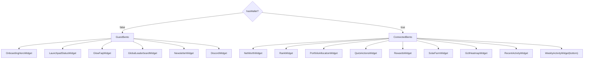

# Bento UI Documentation

## Overview

The `GlowSoftDashboard` (`@app/test/bento.tsx`) features a responsive, grid-based layout that adapts its content based on the user's wallet connection status. This approach ensures a streamlined experience for new users while providing comprehensive tools for connected users.

## Bento layout map

The dashboard uses a **12-column grid** (`grid-cols-12`) with `grid-flow-row-dense`. The core behavior is controlled by one boolean:

- **`hasWallet`**: `true` when we have a wallet address (connected wallet or override), otherwise `false`.

### Connected state (desktop)

When `hasWallet = true`, the Bento layout stays as the full dashboard:

- **Optional row 0 (h-[500px])**:
  - `LaunchpadStatusWidget(variant="full-row")` (col-12) — only shown when Launchpad is live and there are listings or the listings query is loading.
- **Top row (h-[330px])**:
  - `NetWorthWidget` (col-5)
  - `PortfolioAllocationWidget` (col-4)
  - `RankWidget` (col-3)
- **Middle row (h-[380px])**:
  - `SolarFarmWidget` (col-5)
  - `QuickActionsWidget` (col-4)
  - `RewardsWidget` (col-3)
- **Bottom row (h-[380px])**:
  - `GctlHeatmapWidget` (col-5)
  - Activity cluster (col-7):
    - `WeeklyActivityWidget` (col-3)
    - `RecentActivityWidget` (col-4)
    - `GlowFaqWidget` fallback (fills when activity widgets are empty)

### Guest state (desktop)

When `hasWallet = false`, Bento switches to a dedicated onboarding topology (no blurred/locked “real widgets”):

- **Row 1 (h-[340px])**:
  - `OnboardingHeroWidget` (col-6)
  - `LaunchpadStatusWidget` (col-6)
- **Row 2 (h-[400px])**:
  - `GlowFaqWidget` (col-8)
  - `GlobalLeaderboardWidget` (col-4)
- **Row 3 (h-[340px])**:
  - `NewsletterWidget` (col-5)
  - `DiscordWidget` (col-7)

### Flow overview (connected vs guest)

### Shared dialogs / cross-widget interactions

- **Mint & Stake GCTL dialog**: the Bento container owns `MintAndStakeGctlDialog` and exposes a single `onMintAndStakeClick` handler to:
  - `QuickActionsWidget` (“Amplify → Mint & Stake GCTL” tile)
  - `GctlHeatmapWidget` (“Mint & stake GCTL” empty-state CTA)

## Height Contract (Preventing Blank Space)

The bento grid is **row-auto** by default, so widgets must follow a consistent height contract to avoid mismatched rows (e.g. Solar Farm next to Quick Actions).

- **Desktop (`lg` and up)**:
  - **Top row slots** are fixed to `330px` (`lg:h-[330px]`)
  - **Connected state (other rows)** are fixed to `380px` (`lg:h-[380px]`)
  - **Guest state (Row 2)** is fixed to `400px` (`lg:h-[400px]`) to allow more reading room
  - Widgets are implemented to **fill the parent slot** (`h-full`) and use `min-h-0` + internal scrolling where needed.
- **Mobile / Tablet (below `lg`)**:
  - Slots are **auto-height** (content-driven). Widgets avoid unconditional `max-h-*` caps under `lg` so content can expand naturally.

## Transitions & Animations

The dashboard uses `framer-motion` for a polished feel:

- **Entry/Exit**: All conditional widgets use `initial={{ opacity: 0, scale: 0.95 }}`, `animate={{ opacity: 1, scale: 1 }}`, and `exit={{ opacity: 0, scale: 0.95 }}`.
- **Layout Smoothing**: `AnimatePresence` with `mode="popLayout"` ensures that grid items don't jump abruptly when surrounding items are removed or added.

## Widget catalog (product spec)

### `NetWorthWidget` (Glow Worth + holdings)

- **Purpose**: Give the user a single “how big is my Glow position?” number (Glow Worth), plus a quick glance at what they hold (GLW, stablecoins, GCTL, ETH) and recent movement.
- **Appears**: Connected-only (top row).
- **What it shows**:
  - **Glow Worth** headline value (GLW-denominated).
  - **GLW spot price** and 24h delta.
  - A **~13-week Glow Worth chart** (weekly), with a tooltip that can show breakdown (liquid / delegated / unclaimed) for the hovered point.
  - A row of **visible holdings** chips (only for non-zero assets).
- **Key states**:
  - **No wallet**: Not rendered in Bento’s guest layout.
  - **Connecting / reconnecting**: shows a full-card skeleton to avoid “0 GLW” flashes.
  - **Empty** (connected): “No GLW worth yet”.
  - **Loaded**: chart + holdings + “accumulated this week” style signals.
- **Implementation pointer**: `app/test/widgets/net-worth.tsx` (composes wallet balances + rewards breakdown + claim status + swap history into Glow Worth + chart).

### `PortfolioAllocationWidget` (asset mix)

- **Purpose**: Show how the wallet’s holdings are allocated across supported assets.
- **Appears**: Connected-only (top row).
- **Implementation pointer**: `app/test/widgets/portfolio-allocation.tsx`.

### `RankWidget` (Impact Score + tier)

- **Purpose**: Give the user a quick “impact status” snapshot: total Impact Score, a tier label, and direct access to deeper breakdowns.
- **Appears**: Connected-only (top row).
- **What it shows**:
  - **Total Impact Score** and a **tier** (e.g. “SOLAR DOLPHIN” → “SOLAR KRAKEN”).
  - A short subtitle that highlights the latest behavior (e.g. weekly GLW steered when available).
- **Key CTAs / interactions**:
  - **Leaderboard**: opens a modal rendering the full Impact leaderboard UI (same UI as the main Impact tab).
  - **Breakdown**: opens a modal showing the wallet’s weekly breakdown rows.
- **Key states**:
  - **No wallet**: Not rendered in Bento’s guest layout.
  - **Loading**: shows “—” for totals; Breakdown button is disabled until data is present.
- **Implementation pointer**: `app/test/widgets/rank-widget.tsx` (fetches `/impact/glow-score` for a single wallet and reuses `ImpactView` + `ImpactScoreBreakdownDialogContent`).

### `QuickActionsWidget` (start + do-the-next-thing)

- **Purpose**: Provide the highest-leverage next actions with minimal navigation.
- **Appears**: Connected-only (middle row).
- **New user onboarding mode** (no GLW, no delegations, no miners):
  - Presents a single, bold CTA: **“BUY $20 GLW (Start Now)”**.
  - Opening this CTA brings up the Buy GLW flow prefilled with $20.
- **Core actions mode** (existing user):
  - **Liquidity → Add Liquidity** (GLW/USDG) opens a quick add-liquidity dialog.
  - **Launchpad** opens the Launchpad. The tile adapts:
    - If **delegations are live**: it becomes “Delegate GLW” with a “Live” indicator + farm count.
    - If miners are sold out: shows a countdown to the next batch.
  - **Buy GLW → Top Up Wallet** opens the buy flow.
  - **Amplify → Mint & Stake GCTL** triggers the shared Mint+Stake dialog at the Bento level.
- **Implementation pointer**: `app/test/widgets/quick-actions-widget.tsx` (switches between onboarding vs action grid; opens `AddLiquidityQuickDialog`, `LaunchpadDialog`, and the shared Mint+Stake dialog).

### `RewardsWidget` (claimable rewards + next distribution)

- **Purpose**: Show “what can I claim?” and “when is the next distribution?” and provide a single entry point to claiming.
- **Appears**: Connected-only, in the middle row (alongside `SolarFarmWidget` + `QuickActionsWidget`).
- **What it shows**:
  - **Countdown** to the next weekly distribution.
  - **Claimable USD estimate** (includes stablecoins; GLW uses spot price when available).
  - **Lifetime earned** estimate.
- **Key CTAs / interactions**:
  - **Claim** opens a modal containing the full `ClaimsPanel`.
- **Key states**:
  - **Disconnected**: renders in a “disabled” posture (Claim button disabled).
  - **Empty**: can be hidden via `hideIfEmpty`, but Bento currently forces it visible via `hideIfEmpty={false}`.
- **Implementation pointer**: `app/test/widgets/rewards-widget.tsx` (derives claimable totals from finalized weeks + on-chain claim checks; “Claim” reuses `app/wallet/claims-panel`).

### `WeeklyActivityWidget` (Weekly Streak)

- **Purpose**: Make weekly participation legible and shareable: “did I show up this week?” across the last N weeks.
- **Appears**: Connected-only (bottom row activity cluster).
- **How the streak works (user-facing)**:
  - Each week is classified as one of: **delegated**, **miner**, **both**, or **missed**.
  - The widget shows **active weeks count** over the displayed range (default last 24).
  - Hovering a cell shows the week date range + status.
- **Key CTAs / interactions**:
  - **Share on X**: opens a tweet intent that links to the app’s streak share page.
- **Key states**:
  - **Connected but no activity**: “No streak yet” empty-state prompting delegation/miners.
  - Can be hidden via `hideIfEmpty`, but Bento currently forces it visible in both positions.
- **Implementation pointer**: `app/test/widgets/weekly-activity-widget.tsx` (combines delegation + miner activity into a week grid and shares via a deep link).

### `SolarFarmWidget` (Glow Mining performance)

- **Purpose**: Provide a quick performance view of the user’s mining + delegation rewards and a path to deeper farm performance diagnostics.
- **Appears**: Connected-only (middle row).
- **What it shows**:
  - “Current weekly payout” (GLW) and counts for **active miners** and **active delegations**.
  - A stacked bar chart for the **last ~10 weeks** (miners vs delegations rewards).
  - If the wallet has **in-progress positions** (not yet filled):
    - Adds a final **“In progress”** bar with **estimated weekly GLW**.
    - The bar can include both **miners (mining-center)** and **delegations (launchpad)** segments.
  - A “View details” entry point to a deeper performance dialog.
- **Key CTAs / interactions**:
  - **View Details** opens the farm performance dialog.
  - **Dormant state**: “Browse Launchpad” (if farms are available), otherwise a “next batch” countdown.
  - **Retry** if the underlying breakdown query errors.
- **Key states**:
  - **Disconnected (guest)**: shows a _blurred/mock_ version of the performance card (intentional preview) plus connect framing.
  - **Connected but dormant**: “No Active Solar Streams” with guidance + CTAs.
    - Note: if the wallet only has **in-progress** positions, we treat that as activity (so the UI doesn't incorrectly show a fully dormant state).
  - **Connected but too new**: “No weekly rewards data yet”.
- **Implementation pointer**: `app/test/widgets/solar-farm-widget.tsx` (uses rewards breakdown for realized history, and split activity + listing score estimates to render the “In progress” bar when applicable).

### `FarmsPerformanceDialogContent` (Farm Performance dialog)

- **Purpose**: Explain “is this miner / delegation on track?” using a simple lifecycle model: **time elapsed vs value recovered/earned**.
- **Appears**: Modal opened from `SolarFarmWidget`.
- **What it shows**:
  - A list of farms with two tracks:
    - **Time**: weeks elapsed vs total lifecycle weeks.
    - **Value**: recovered principal/deposit + emissions earned (in the farm’s denomination).
  - A **filter** (All / Miners / Delegations / Other / In progress) and sorting by performance.
  - **In-progress rows** (both launchpad + mining-center) appear in:
    - **ALL** (prepended to the list)
    - **IN PROGRESS** (same row layout; scoped list)
  - In-progress rows show **funding progress** plus **estimated weekly GLW** (`GLW/wk`).
  - Status flags like **Profit**, **Lagging**, **On track**.
- **Implementation pointer**: `app/test/widgets/farms-performance-dialog.tsx` (maps farms into a consistent performance row model).

### `GctlHeatmapWidget` (GCTL treemap / steering overview)

- **Purpose**: Show how the user’s GCTL is split (**liquid vs staked**) and where it’s staked (projects/regions), because this is the steering primitive.
- **Appears**: Connected-only bottom row.
- **What it shows**:
  - Total GCTL and split percentages (liquid vs staked).
  - A “treemap”-style visualization of the top staked buckets.
- **Key CTAs / interactions**:
  - **Guest**: connect CTA overlay (intentional preview behind blur).
  - **Connected but empty**: “Mint & stake GCTL” CTA that opens the shared Mint+Stake dialog.
- **Implementation pointer**: `app/test/widgets/gctl-heatmap-widget.tsx` (fetches GCTL balances + region stakes and visualizes them).

### `RecentActivityWidget` (recent splits + swaps)

- **Purpose**: Provide an audit trail of “what just happened?” across the user’s recent onchain actions.
- **Appears**: Connected-only bottom row.
- **Key behavior**:
  - Hidden entirely when no wallet is present (Bento keeps the guest view focused).
  - Delegates rendering to the wallet’s `RecentActivity` feed UI.
- **Implementation pointer**: `app/test/widgets/recent-activity-widget.tsx` (thin wrapper around the shared recent activity feed).

### `GlowFaqWidget` (guest onboarding FAQ)

- **Purpose**: Explain Glow in a low-friction way for guests: what Glow is, what GLW is, what delegation is, what miners are.
- **Appears**:
  - Guest layout (Row 2).
  - Connected layout fallback in the bottom-row activity cluster (fills when activity widgets are empty).
- **Key behavior**: Uses collapsible Q&A items; scrolls internally on desktop to respect the height contract.
- **Implementation pointer**: `app/test/widgets/glow-faq-widget.tsx`.

### `OnboardingHeroWidget` (guest hero)

- **Purpose**: Give guests a clear “what is this?” and a path to connect / get started.
- **Appears**: Guest layout (Row 1).
- **Implementation pointer**: `app/test/widgets/onboarding-hero-widget.tsx`.

### `LaunchpadStatusWidget` (launchpad status / CTA)

- **Purpose**: Communicate whether the Launchpad is live and what’s available right now.
- **Appears**:
  - Guest layout (Row 1).
  - Optional connected Row 0 when Launchpad is live and listings are loading/available.
- **Implementation pointer**: `app/test/widgets/launchpad-status-widget.tsx`.

### `GlobalLeaderboardWidget` (guest leaderboard teaser)

- **Purpose**: Show global leaderboard context for guests without requiring a wallet.
- **Appears**: Guest layout (Row 2).
- **Implementation pointer**: `app/test/widgets/global-leaderboard-widget.tsx`.

### `NewsletterWidget` (guest capture)

- **Purpose**: Newsletter signup / updates surface for guests.
- **Appears**: Guest layout (Row 3).
- **Implementation pointer**: `app/test/widgets/newsletter-widget.tsx`.

### `DiscordWidget` (guest community)

- **Purpose**: Community entry point for guests.
- **Appears**: Guest layout (Row 3).
- **Implementation pointer**: `app/test/widgets/discord-widget.tsx`.

### `AddLiquidityQuickDialog` (GLW/USDG quick LP)

- **Purpose**: Provide a fast “add liquidity” flow from Bento without navigating away.
- **Appears**: Opened from `QuickActionsWidget`.
- **What it does**:
  - Lets the user enter GLW and USDG amounts, keeps them roughly in sync with the pool ratio, and routes into a review/confirm flow.
  - Validates missing input, balance constraints, and likely-failure scenarios before enabling “Review”.
- **Navigation note**: When the dialog suggests swapping (e.g. “Need more USDG? Go to Swap”), the CTA returns to `/` (the dashboard entrypoint), which is the current swap entry surface.
- **Implementation pointer**: `app/test/widgets/add-liquidity-quick-dialog.tsx` (quick inputs + review handoff to the main liquidity dialog).

## Concepts & glossary (how Bento ties together)

### Glow Worth

- **Definition**: a wallet’s GLW-denominated “position” in the Glow system.
- **Formula**:

\[
\text{GlowWorth} = \text{LiquidGLW} + \text{DelegatedActiveGLW} + \text{UnclaimedGLWRewards}
\]

- **Where it shows up**:
  - `NetWorthWidget` headline number and history chart.
- **Deep dive**: `app/test/widgets/GLOW-WORTH.md`.

### Glow Impact Score

- **Definition**: a points system rewarding actions that grow onchain climate impact, especially steering via staked GCTL.
- **Where it shows up**:
  - `RankWidget` (total score + tier, breakdown modal)
  - `RankWidget → Leaderboard` (full leaderboard view)
- **Deep dive**: `app/test/widgets/GLOW-IMPACT-SCORE.md`.

### Impact leaderboard (Impact tab)

- **Definition**: the “status-only” leaderboard UI that explains why wallets rank where they do and what they can do now to improve.
- **Important UX rules (inherited by the Rank widget’s Leaderboard modal)**:
  - Only **Top 3** show numeric rank (`#1`, `#2`, `#3`).
  - Everyone else shows **percentile** (e.g. `Top 5%`), and percentiles are based on **global** data (filters/search must not change percentile math).
  - ENS-supported wallet search.
- **Deep dive**: `app/stats/rewards/impact-leaderboard.md`.
