# Dashboard UI Documentation

## Overview

The `GlowSoftDashboard` component (located at `app/test/bento.tsx`) is the main dashboard interface for Glow. It features a **section-based vertical layout** that adapts its content based on the user's wallet connection status, providing a streamlined experience for new users while offering comprehensive tools for connected users.

### Important: Not Actually a Bento Grid

**Despite the file name `bento.tsx`, this is NOT a bento grid layout.** The dashboard has evolved from an earlier bento grid design into a **section-based vertical layout with themed groupings**.

The current architecture uses:

- Vertical sections with semantic headings (e.g., "Mining & Rewards")
- Single cards per section containing multiple widgets
- Internal dividers (`divide-x`, `divide-y`) instead of grid gaps
- Content-driven auto-height instead of fixed grid cells

**Why the name persists:** The file name is historical and hasn't been renamed to avoid breaking references and routes.

## Layout Architecture

The dashboard uses **thematic sections** where each section is a single card containing multiple widgets separated by dividers (not individual grid cells). The core behavior is controlled by one boolean:

- **`hasWallet`**: `true` when we have a wallet address (connected wallet or override), otherwise `false`.

### Loading States

The dashboard shows three distinct states based on connection status:

1. **`hasWallet === true`**: Shows connected dashboard (sections described below)
2. **`isWalletSettling === true`**: Shows `DashboardConnectingSkeleton` during wallet connection
   - Condition: `isMounted && !walletAddressOverride && !hasWallet && (isConnecting || isReconnecting) && !hasAnyDialogOpen`
   - Displays placeholder skeleton grid mimicking the expected layout
3. **`hasWallet === false`**: Shows guest dashboard (sections described below)

All three states are wrapped in `AnimatePresence` with `mode="wait"` for smooth transitions.

### Connected state

When `hasWallet = true`, the dashboard shows these vertical sections:

#### Optional Section 0: Launchpad Live/Approaching

- **`LaunchpadStatusWidget(variant="full-row")`** — full-width section, only shown when:
  - Launchpad is live with available listings, OR
  - Launchpad opens within 1 hour
- Section header: "Launchpad Live" or "Launchpad Opening Soon"

#### Section 1: Dashboard Header Band

- Single card containing three widgets in a horizontal row (divided by vertical dividers):
  - `RankWidget(variant="hero")` — Impact Score (lg:col-span-3)
  - `NetWorthWidget(variant="minimal")` — Glow Worth + chart (lg:col-span-5)
  - `WalletWidget(variant="minimal")` — Holdings + Swap/Send (lg:col-span-2)
- Uses `grid-cols-1 lg:grid-cols-10` with `divide-x` on desktop

#### Section 2: Mining & Rewards

- Section header: "Mining & Rewards"
- Single card containing two widgets (divided):
  - `SolarFarmWidget(variant="minimal")` — performance + chart (lg:col-span-2, lg:pr-8)
  - `RewardsWidget(variant="minimal")` — claimable + countdown (lg:pl-8)
- Uses `grid-cols-1 lg:grid-cols-3` with `divide-x divide-y lg:divide-y-0`

#### Section 3: Grow Your Impact

- Section header: "Grow Your Impact"
- Single card containing two widgets (divided):
  - `LaunchpadStatusWidget(variant="minimal")` — listings or countdown (lg:pr-8)
  - `GctlHeatmapWidget(variant="minimal")` — steering control (lg:pl-8)
- Uses `grid-cols-1 lg:grid-cols-2` with `divide-x divide-y lg:divide-y-0`

#### Section 4: Your Journey

- Section header: "Your Journey"
- Single card with two sub-sections:
  1. **Top sub-section** (three widgets in divided row):
     - `WeeklyActivityWidget(variant="minimal")` (lg:col-span-4)
     - `RecentActivityWidget(variant="minimal")` (lg:col-span-5)
     - `PortfolioSummaryWidget(variant="minimal")` (lg:col-span-3)
     - Divided with `divide-x divide-y lg:divide-y-0`
     - Bottom border: `border-b border-border/50`
  2. **My Farms sub-section**:
     - Heading: "My Farms"
     - `MyFarmsGridSection` — full farm grid with view modes

### Guest state

When `hasWallet = false`, the dashboard shows these onboarding-focused sections (no blurred/locked widgets):

#### Optional Section 0: Launchpad Live/Approaching

- Same as connected state - **`LaunchpadStatusWidget(variant="full-row")`**

#### Section 1: Hero Section

- Single card containing two widgets (divided):
  - `OnboardingHeroWidget(variant="minimal")` — value prop + Buy GLW CTA (lg:col-span-1)
  - `LaunchpadStatusWidget(variant="minimal")` — listings or countdown (lg:col-span-1)
- Uses `grid-cols-1 lg:grid-cols-2` with `divide-y lg:divide-y-0`

#### Section 2: Community & Leaderboard

- Section header: "Community & Leaderboard"
- Single card containing two widgets (divided):
  - `CommunityActivityWidget(variant="minimal")` — recent activity feed (lg:col-span-8)
  - `GlobalLeaderboardWidget(variant="minimal")` — top 3 leaderboard (lg:col-span-4)
- Uses `grid-cols-1 lg:grid-cols-12` with `divide-x divide-y lg:divide-y-0`

#### Section 3: Protocol Metrics

- Section header: "Protocol Metrics"
- Single card (no internal division):
  - `ProtocolMetricsWidget` — metrics cards + chart
- Full width, no grid divisions

#### Section 4: Education

- Section header: "Education"
- Single card containing two widgets (divided):
  - `GlowFaqWidget(variant="minimal")` — FAQ accordion (lg:col-span-7)
  - `BlogFeaturedWidget` — featured article (lg:col-span-5)
- Uses `grid-cols-1 lg:grid-cols-12` with `divide-x divide-y lg:divide-y-0`

#### Section 5: Stay Connected

- Section header: "Stay Connected"
- Single card containing two widgets (divided):
  - `NewsletterWidget(variant="minimal")` — email signup (lg:col-span-5)
  - `DiscordWidget(variant="minimal")` — Discord invite (lg:col-span-7)
- Uses `grid-cols-1 lg:grid-cols-12` with `divide-x divide-y lg:divide-y-0`

### Flow overview (connected vs guest)

```mermaid
flowchart TD
  hasWallet{hasWallet?}

  hasWallet -->|false| guest[Guest Dashboard]
  hasWallet -->|true| connected[Connected Dashboard]

  guest --> HeroSection["Hero Section"]
  guest --> CommunitySection["Community & Leaderboard"]
  guest --> ProtocolSection["Protocol Metrics"]
  guest --> EducationSection["Education"]
  guest --> StayConnectedSection["Stay Connected"]

  HeroSection --> OnboardingWidget["OnboardingHeroWidget"]
  HeroSection --> LaunchpadGuest["LaunchpadStatusWidget"]
  CommunitySection --> CommunityWidget["CommunityActivityWidget"]
  CommunitySection --> LeaderboardWidget["GlobalLeaderboardWidget"]
  ProtocolSection --> ProtocolWidget["ProtocolMetricsWidget"]
  EducationSection --> FAQWidget["GlowFaqWidget"]
  EducationSection --> BlogWidget["BlogFeaturedWidget"]
  StayConnectedSection --> NewsletterWidget["NewsletterWidget"]
  StayConnectedSection --> DiscordWidget["DiscordWidget"]

  connected --> HeaderSection["Dashboard Header Band"]
  connected --> MiningSection["Mining & Rewards"]
  connected --> ImpactSection["Grow Your Impact"]
  connected --> JourneySection["Your Journey"]

  HeaderSection --> RankWidget["RankWidget"]
  HeaderSection --> NetWorthWidget["NetWorthWidget"]
  HeaderSection --> WalletWidget["WalletWidget"]
  MiningSection --> SolarWidget["SolarFarmWidget"]
  MiningSection --> RewardsWidget["RewardsWidget"]
  ImpactSection --> LaunchpadWidget["LaunchpadStatusWidget"]
  ImpactSection --> GctlWidget["GctlHeatmapWidget"]
  JourneySection --> WeeklyWidget["WeeklyActivityWidget"]
  JourneySection --> RecentWidget["RecentActivityWidget"]
  JourneySection --> PortfolioWidget["PortfolioSummaryWidget"]
  JourneySection --> FarmsGrid["MyFarmsGridSection"]
```



## Layout Patterns

### Section Structure

Each section follows this pattern:

```tsx
<section className="flex flex-col gap-4">
  {/* Optional section header */}
  <SectionHeader title="Section Name" />

  {/* Single card container */}
  <div className="rounded-2xl bg-card dark:bg-muted/20 border border-border/50 p-6 lg:p-8">
    {/* Grid with dividers for widgets */}
    <div className="grid grid-cols-1 lg:grid-cols-N gap-6 lg:gap-0 divide-y lg:divide-y-0 lg:divide-x divide-border/50">
      <div className="pb-6 lg:pb-0 lg:pr-8">
        <WidgetComponent variant="minimal" />
      </div>
      <div className="pt-6 lg:pt-0 lg:pl-8">
        <WidgetComponent variant="minimal" />
      </div>
    </div>
  </div>
</section>
```

### Key Layout Principles

1. **Sections not grids**: Each thematic grouping is a `<section>` with a single card
2. **Dividers not gaps**: Widgets within a card are separated by `divide-x` (desktop) and `divide-y` (mobile)
3. **Padding for spacing**: Divider-adjacent widgets use `lg:pr-8`/`lg:pl-8` for internal spacing
4. **Mobile stacking**: All sections use `flex-col` or `grid-cols-1` on mobile, expanding to multi-column on `lg`
5. **Auto-height**: No fixed heights - sections expand based on content
6. **Minimal variants**: Most widgets receive `variant="minimal"` for transparent backgrounds

### Shared Dialogs & Cross-Widget Interactions

The dashboard container owns several shared dialogs:

- **`MintAndStakeGctlDialog`**: Opened by:
  - `RankWidget` → "Mint & Stake GCTL" button
  - `GctlHeatmapWidget` → empty state CTA
- **`DepositDialog`**: Opened by:
  - `LaunchpadStatusWidget` → "Pay Deposit" action on listings
- **`BuyGlowDialog`**: Opened by:
  - `NetWorthWidget` → "Buy GLW" button
  - `OnboardingHeroWidget` → "Buy GLW" CTA
  - `LaunchpadStatusWidget` → "Buy GLW" button
- **`RefundClaimsDialog`**: Automatically shown when wallet has refundable fractions

## Transitions & Animations

The dashboard uses `framer-motion` for state transitions:

- **Dashboard state switching** (connected ↔ guest): Wrapped in `AnimatePresence` with `mode="wait"`
  - `initial={{ opacity: 0 }}`, `animate={{ opacity: 1 }}`, `exit={{ opacity: 0 }}`
  - Duration: 150ms
- **Individual widgets**: Handle their own internal transitions (hover states, data updates, etc.)
- **Loading skeleton**: Shown during `isWalletConnecting` state with fade-in

## Widget Catalog

### Core Widgets (Connected State)

#### `NetWorthWidget`

- **Purpose**: Display the user's total GLW position (Glow Worth) with historical chart and accumulation metrics.
- **Appears**: Connected state, Dashboard Header Band section
- **Variants**: `minimal` (transparent bg, used in section), `default` (standalone card)
- **What it shows**:
  - **Glow Worth** headline (GLW value + "GLW" label)
  - **"Accumulated this week"** badge showing weekly growth
  - **~13-week historical chart** with Glow Worth over time
  - Chart tooltip shows: week, date, total GLW, and breakdown (liquid/delegated/unclaimed)
  - "Breakdown" button (opens GlowWorthBreakdownDialog)
  - "Price Chart" external link button (to Defined.fi pool)
- **Key states**:
  - **Guest**: Not shown (OnboardingHeroWidget replaces it)
  - **Loading**: Full skeleton with grid pattern background
  - **Empty** (connected, zero GLW): Shows OnboardingHeroWidget instead
  - **Loaded**: Chart + metrics + buttons
- **Props**: `walletAddress`, `variant`, `onBuyGlowClick`
- **File**: `app/test/widgets/net-worth.tsx`

#### `WalletWidget`

- **Purpose**: Quick view of holdings (GLW, ETH, USDC, USDG) with Swap and Send actions
- **Appears**: Connected state, Dashboard Header Band section
- **Variants**: `minimal` (transparent bg), `default` (standalone)
- **What it shows**:
  - "Your Wallet" heading
  - List of 4 token balances with icons (GLW, ETH, USDC, USDG)
  - **Swap** button (opens SwapDialog)
  - **Send** button (opens SendDialog)
- **Key states**:
  - **Guest**: Returns `null` (not rendered)
  - **Loading**: Shown during connection
- **File**: `app/test/widgets/wallet-widget.tsx`

#### `RankWidget`

- **Purpose**: Display Impact Score, rank, percentile, and provide access to breakdown and leaderboard
- **Appears**: Connected state, Dashboard Header Band section
- **Variants**: `hero` (larger text, used in header), `default` (standalone)
- **What it shows**:
  - "Impact Score" title with help tooltip/drawer
  - **Total points** (large display with "pts")
  - **Rank** (e.g., "#153") and **Percentile** (e.g., "Top 5%")
  - **Impact Indicators Row** (6 icons showing: miner, streak, steering, emissions, vault, worth)
  - **Buttons**:
    - "Rank Up" or "Mint & Stake GCTL" (shown if score is 0)
    - "Leaderboard" (link to /stats/rewards)
    - "Breakdown" (opens ImpactScoreBreakdownDialog)
- **Key states**:
  - **Guest**: Shows blurred placeholder with "Connect your wallet" prompt
  - **Loading**: Full skeleton
  - **Connected**: Live data with clickable indicators
- **Interactions**:
  - Clicking impact indicators opens relevant dialogs (LaunchpadDialog, BuyGlowDialog, MintAndStakeGctlDialog)
  - `onMintAndStakeClick` prop can override default mint/stake behavior
- **File**: `app/test/widgets/rank-widget.tsx`

#### `RewardsWidget`

- **Purpose**: Display claimable rewards and countdown to next distribution
- **Appears**: Connected state, Mining & Rewards section
- **Variants**: `minimal` (transparent bg), `default` (standalone)
- **What it shows**:
  - "Rewards" heading
  - **Countdown** to next weekly claim (if there's pending rewards)
  - **Available Now** section showing:
    - Primary: GLW amount (large display)
    - Secondary: USDG amount (if any)
  - **"Next claim"** badge showing upcoming rewards
  - **"Claim Rewards"** button (opens ClaimsPanel in dialog)
- **Key states**:
  - **Guest**: Shows "Connect to view" or "—"
  - **Loading**: Skeleton animation
  - **No rewards**: "No Rewards" button (disabled)
  - **Has rewards**: Active claim button with amounts
- **Props**: `walletAddress`, `hideIfEmpty`, `variant`
- **File**: `app/test/widgets/rewards-widget.tsx`

#### `SolarFarmWidget`

- **Purpose**: Display mining performance, rewards history, and farm statistics
- **Appears**: Connected state, Mining & Rewards section
- **Variants**: `minimal` (transparent bg), `default` (standalone)
- **What it shows**:
  - "Glow Mining" heading with "View Details" button
  - **KPI**: "Current Weekly Payout" (GLW amount + optional USDG)
  - **Stats card** (clickable): Active miners/delegations/other count
  - **Stacked bar chart** (last 10 weeks):
    - Yellow: Miner rewards
    - Purple: Delegation rewards
    - Green: Other rewards
    - Orange: Protocol deposit (USDG)
    - Special "In progress" bar if wallet has active unfilled sponsorships
  - Custom tooltip showing per-week breakdown
- **Key states**:
  - **Guest**: Blurred preview with "Connect your wallet" overlay
  - **Loading**: Skeleton
  - **Empty/Dormant**: Full-height empty state with:
    - "No Active Solar Streams" heading
    - Education cards (How Mining Works, Guide to Delegation)
    - "Browse Launchpad" button or countdown to next batch
  - **No data yet**: "No weekly rewards data yet" message
  - **Active**: Chart + stats + View Details button
- **Interactions**:
  - "View Details" button opens `FarmsPerformanceDialogContent`
  - Stats card also opens performance dialog
  - Empty state "Browse Launchpad" opens LaunchpadDialog
- **File**: `app/test/widgets/solar-farm-widget.tsx`

#### `WeeklyActivityWidget`

- **Purpose**: Visualize weekly participation streak (delegations, miners, or both)
- **Appears**: Connected state, Your Journey section
- **Variants**: `minimal`, `flow`, `default`
- **What it shows**:
  - "Weekly Streak" heading
  - **Current Streak** number (large display, "X Wks")
  - **Grid of week cells** (last 24 weeks):
    - Color-coded: delegation (purple), miner (orange), both (green), missed (dashed border)
    - Tooltip on hover: week range, status, amounts
  - **Legend** at bottom showing color meanings + "Streak X/4"
- **Key states**:
  - **Guest**: Blurred placeholder grid with "Connect your wallet" prompt
  - **Loading**: Skeleton
  - **Empty**: "No streak yet" message
  - **Active**: Live grid with streak count
- **Props**: `walletAddress`, `hideIfEmpty`, `variant`
- **File**: `app/test/widgets/weekly-activity-widget.tsx`

#### `GctlHeatmapWidget`

- **Purpose**: Visualize GCTL holdings and steering (where emissions are directed via staked GCTL)
- **Appears**: Connected state, Grow Your Impact section
- **Variants**: `minimal`, `flow`, `default`
- **What it shows**:
  - "Glow Control (GCTL)" heading with info tooltip + "Boost" button
  - **KPI Grid**:
    - Left: "My Holdings" (total GCTL, breakdown of liquid vs active)
    - Right: "Steering Score" (estimated points from steering)
  - **Active Stakes** list showing top 4 regions:
    - Region name, GCTL staked, estimated GLW/wk directed
    - Progress bars normalized to show relative impact
    - "Directing X% of Region" label
  - **Warning banner** if liquid GCTL exists (unused influence)
- **Key states**:
  - **Guest**: "Steer Solar Rewards" value prop with ConnectButton
  - **Loading**: Skeleton
  - **Zero GCTL**: Sales pitch UI - "Direct Global Emissions" with gamification (+3 points per GLW) and "Mint & Stake GCTL" CTA
  - **Active**: KPI grid + region stakes list
- **Interactions**:
  - "Boost" button or "Mint & Stake GCTL" CTA triggers `onMintAndStakeClick`
  - Clicking empty stakes area triggers mint & stake
- **File**: `app/test/widgets/gctl-heatmap-widget.tsx`

#### `RecentActivityWidget`

- **Purpose**: Show recent onchain activity (splits, swaps)
- **Appears**: Connected state, Your Journey section
- **Variants**: `minimal`, `flow`, `default`
- **What it shows**:
  - Delegates to `RecentActivity` component from wallet page
  - Shows last 4 items by default (`maxItems={4}`)
  - "Expand" button opens full activity feed in dialog
- **Key states**:
  - **Guest**: Returns `null` (not rendered)
  - **Empty**: Hidden if `hideIfEmpty={true}`
- **Props**: `walletAddress`, `hideIfEmpty`, `variant`
- **File**: `app/test/widgets/recent-activity-widget.tsx`

#### `PortfolioSummaryWidget`

- **Purpose**: Quick summary of active mining positions (delegated GLW, miners, delegations)
- **Appears**: Connected state, Your Journey section
- **Variants**: `minimal`, `default`
- **What it shows**:
  - "Mining Summary" heading
  - **Three rows** (clickable cards):
    1. "Delegated GLW" - active delegated amount with info tooltip
    2. "Active Miners" - count of active miner farms
    3. "Active Delegations" - count of active delegation farms
  - Each row has icon, label, and value
- **Key states**:
  - **Guest connecting**: Skeleton
  - **Guest**: Not rendered (returns null)
  - **Loaded**: Clickable rows, clicking opens FarmsPerformanceDialog with filter
- **Interactions**:
  - Clicking rows opens performance dialog filtered to that type
- **File**: `app/test/widgets/portfolio-summary-widget.tsx`

#### `MyFarmsGridSection`

- **Purpose**: Comprehensive farm portfolio view with multiple visualization modes
- **Appears**: Connected state, Your Journey section (bottom of card)
- **What it shows**:
  - **Controls bar**:
    - Sort dropdown (Default, Newest, Name A-Z, Size Highest)
    - View mode toggles (Default, Compact, Mosaic, List)
  - **Farm cards/rows** showing:
    - Farm images, name, region
    - Type badge (Miner, Delegation, Rewards, In Progress)
    - Status: weeks active, cost, earned, progress %
    - Special "Starts Next Week" badge for pending farms
  - **View modes**:
    - Default: Standard card grid (3 cols on lg)
    - Compact: Smaller cards (4-5 cols)
    - Mosaic: Image-focused grid (5-6 cols)
    - List: Table view with all details
- **Data sources**:
  - Realized farms from rewards breakdown
  - In-progress sponsorships from splits activity
  - "Other" farms (Clean Grid Project rewards)
  - Pending start farms (filled but not yet active)
- **Interactions**:
  - Clicking any farm opens `FarmDetailDialog` with full breakdown
- **File**: `app/test/widgets/my-farms-grid-section.tsx`

### Guest State Widgets

#### `OnboardingHeroWidget`

- **Purpose**: Value proposition and entry point for new users
- **Appears**:
  - Guest state, Hero section
  - Replaces NetWorthWidget when connected user has zero GLW
- **Variants**: `minimal`, `default`
- **What it shows**:
  - "New to Glow? Start Here" label with green pulse dot
  - **Quote**: David Vorick's "$20 of GLW" vision statement
  - **"Buy GLW" button** (opens BuyGlowDialog)
- **Visual design**: Large typography with Glow logo watermark background
- **File**: `app/test/widgets/onboarding-hero-widget.tsx`

#### `LaunchpadStatusWidget`

- **Purpose**: Show Launchpad status (live, approaching, countdown) and available listings
- **Appears**:
  - Both guest and connected states in multiple contexts
  - Optional full-row section when live/approaching
  - Hero section (guest), Grow Your Impact section (connected)
- **Variants**: `card`, `full-row`, `flow`, `minimal`
- **What it shows** (depends on state):
  - **Live state**:
    - "Glow Launchpad" heading
    - Tabs: All / Delegations / Miners / Activity (only in `full-row`)
    - Shows LaunchpadView carousel or educational cards
    - "Buy GLW" button in header
  - **Approaching state** (< 1 hour):
    - "Launchpad Opening Soon" heading
    - Countdown timer
    - Educational cards (delegation/mining guides)
  - **Countdown state** (> 1 hour):
    - "New Solar Farm Listing In..." heading
    - Large countdown (DHMS format)
    - Preparation section with GLW price + info
- **Props**: `variant`, `isApproaching`, `onPayDeposit`, `forcedType`
- **File**: `app/test/widgets/launchpad-status-widget.tsx`

#### `CommunityActivityWidget`

- **Purpose**: Display recent Launchpad activity (deposits, claims, etc.)
- **Appears**: Guest state, Community & Leaderboard section
- **Variants**: `minimal`, `default`
- **What it shows**:
  - "Latest Launchpad Activity" heading with "Recent" badge
  - Activity feed showing last 5 items (uses `SponsoredFarmsActivity` component)
  - "See All Activity" button (opens full feed in dialog)
- **File**: `app/test/widgets/community-activity-widget.tsx`

#### `GlobalLeaderboardWidget`

- **Purpose**: Show top performers on Impact Leaderboard
- **Appears**: Guest state, Community & Leaderboard section
- **Variants**: `minimal`, `default`
- **What it shows**:
  - "Impact Leaderboard" heading with "Top 3" badge
  - Top 3-5 wallets (ENS names if available):
    - Rank badge (colored for #1)
    - Wallet address/ENS
    - Total points
    - Glow Worth
  - "See Full Leaderboard" button (links to /stats/rewards)
- **File**: `app/test/widgets/global-leaderboard-widget.tsx`

#### `ProtocolMetricsWidget`

- **Purpose**: Show protocol-level metrics and farm onboarding chart
- **Appears**: Guest state, Protocol Metrics section
- **What it shows**:
  - **4 metric cards**:
    1. GLW Price (clickable, links to Defined.fi)
    2. Market Cap
    3. GLW Delegated (% of supply)
    4. "View All Stats" CTA card
  - **Chart**: "New Solar Farms & Protocol Deposit" (last 3 months)
    - Bar chart: farm count
    - Line chart: protocol deposit value
    - Dual Y-axis
- **File**: `app/test/widgets/protocol-metrics-widget.tsx`

#### `GlowFaqWidget`

- **Purpose**: Educational FAQ for new users
- **Appears**: Guest state, Education section
- **Variants**: `minimal`, `default`
- **What it shows**:
  - "Glow FAQ" heading with "Documentation" badge
  - **Split layout** (2-column on desktop):
    - Left: Questions list (clickable)
    - Right: Selected answer display
  - **5 questions**: What is Glow, What is GLW, Delegating, Miners, Impact Leaderboard
- **File**: `app/test/widgets/glow-faq-widget.tsx`

#### `BlogFeaturedWidget`

- **Purpose**: Featured blog post with image and metadata
- **Appears**: Guest state, Education section
- **What it shows**:
  - Full-height card with background image
  - Gradient overlay
  - Category badge
  - Title, description, metadata (date, read time)
  - Author info
  - External link icon
- **Hardcoded post**: "Progressive Vaults: Competitive Deposit Recovery in Glow"
- **File**: `app/test/widgets/blog-featured-widget.tsx`

#### `NewsletterWidget`

- **Purpose**: Newsletter email capture
- **Appears**: Guest state, Stay Connected section
- **Variants**: `minimal`, `default`
- **What it shows**:
  - Decorative background with Mail icon watermark
  - "Newsletter" label with Sparkles icon
  - "Stay in the loop." heading
  - Description text
  - Email input with submit button
  - Success state with checkmark
- **Interactions**: Submits to `/api/newsletter`, tracks events, shows toast
- **File**: `app/test/widgets/newsletter-widget.tsx`

#### `DiscordWidget`

- **Purpose**: Discord community invite
- **Appears**: Guest state, Stay Connected section
- **Variants**: `minimal`, `default`
- **What it shows**:
  - Full Discord-branded card (purple bg)
  - Giant Discord logo watermark
  - "ONLINE" indicator with pulse animation
  - "Join the conversation in Discord." heading
  - Stats: "7k+ Members", "24/7 Community"
  - External link icon in bottom-right
- **Behavior**: Entire card is a link to https://discord.gg/glowfnd
- **File**: `app/test/widgets/discord-widget.tsx`

## Supporting Components & Dialogs

### `FarmsPerformanceDialogContent`

- **Purpose**: Detailed farm performance analysis with filters and sorting
- **Opened from**: SolarFarmWidget, PortfolioSummaryWidget
- **What it shows**:
  - Filter tabs: All / Miners / Delegations / Other / In Progress
  - Farm list with performance metrics
  - Time progress (weeks active vs total)
  - Value progress (cost vs earned)
  - Status indicators (Profit, On Track, Lagging)
  - In-progress farms show funding % and estimated GLW/wk
- **File**: `app/test/widgets/farms-performance-dialog.tsx`

## Concepts & Glossary

### Shared Hooks & Data

#### `useWalletPortfolio`

- **Purpose**: Unified data hook for wallet holdings, Glow Worth, and allocations
- **Used by**: `NetWorthWidget`, `WalletWidget`, `PortfolioSummaryWidget`
- **Returns**:
  - `glowWorthGlw` — total Glow Worth value
  - `glowWorthBreakdown` — split into liquid/delegated/unclaimed
  - `weeklyAccumulatedGlw` — growth in current week
  - `chartData` — 13-week historical Glow Worth points
  - `holdings` — wallet-held tokens (GLW, USDC, USDG, ETH)
  - `allocationItems` — holdings with USD values and %
  - Loading and error states
- **File**: `app/test/widgets/use-wallet-portfolio.ts`

### Key Concepts

#### Glow Worth

- **Definition**: A wallet's total GLW-denominated position in the Glow ecosystem
- **Formula**:

\[
\text{GlowWorth} = \text{LiquidGLW} + \text{DelegatedActiveGLW} + \text{UnclaimedGLWRewards}
\]

- **Where it appears**:
  - `NetWorthWidget` — headline value and historical chart
  - `RankWidget` — contributes to Impact Score (continuous points)
  - `GlobalLeaderboardWidget` — shown for top wallets
- **Deep dive**: `app/test/widgets/GLOW-WORTH.md`

#### Glow Impact Score

- **Definition**: Points system rewarding climate impact actions (especially steering via staked GCTL)
- **Scoring**:
  - +1 point per GLW earned in emissions
  - +3 points per GLW steered via staked GCTL
  - +0.005 points per week per GLW delegated (vault bonus)
  - +0.001 points per week per GLW in "GLW Worth" (continuous)
  - Weekly multipliers: base 1× (3× with cash miner), streak bonus up to +1.0×
- **Where it appears**:
  - `RankWidget` — total score, rank, percentile, breakdown, impact indicators
  - `GlobalLeaderboardWidget` — global top performers
  - `GctlHeatmapWidget` — steering score contribution
- **Deep dive**: `app/test/widgets/GLOW-IMPACT-SCORE.md`

#### Weekly Streak

- **Definition**: Consecutive weeks of participation (delegations, miners, or both)
- **Mechanics**:
  - Each week classified as: delegated, miner, both, or missed
  - Streak resets if a week is missed
  - Streak bonus in Impact Score: +0.25× per week, caps at +1.0× (4 weeks)
- **Where it appears**:
  - `WeeklyActivityWidget` — visual grid of last 24 weeks with current streak count

## Design Patterns

### Section-Based Layout (Not Bento Grid)

The dashboard uses **themed sections** instead of a freeform bento grid:

1. **Vertical flow**: Sections stack vertically with gaps
2. **Single card per section**: Each section wraps widgets in one rounded card
3. **Internal dividers**: Widgets within sections use `divide-x` and `divide-y` instead of grid gaps
4. **Semantic grouping**: Sections group related functionality (e.g., "Mining & Rewards")
5. **Responsive stacking**: Desktop uses horizontal splits with dividers, mobile stacks vertically
6. **No fixed heights**: Sections auto-expand based on content

### Widget Variant Pattern

Most widgets support a `variant` prop:

- **`default`**: Standalone card with background and border
- **`minimal`**: Transparent background, borderless (for use in section cards)
- **`hero`**: Larger sizing for prominent placement (e.g., RankWidget in header)
- **`flow`**: Alternative styling for certain layouts

When using `variant="minimal"`, widgets render without their own card wrapper, relying on the parent section's card for background and borders.

### State-Driven Visibility

Widgets handle multiple states gracefully:

- **Guest**: Usually shows blurred preview, connect prompt, or returns `null`
- **Loading**: Skeleton components matching expected layout
- **Empty**: Value props, educational content, or calls-to-action
- **Active**: Full functionality with data
- **Error**: Error message with retry button

### Cross-Widget Coordination

The dashboard container manages:

- Dialog open/close state for shared dialogs
- Event handlers passed down to widgets (`onMintAndStakeClick`, `onPayDeposit`, `onBuyGlowClick`)
- Automatic refund toast/dialog when wallet has claimable refunds
- Query invalidation after successful actions

## Helper Components

### `SectionHeader`

Small component used to display section titles consistently:

```tsx
function SectionHeader({ title }: { title: string }) {
  return (
    <h2 className="text-sm font-mono uppercase tracking-wider text-muted-foreground mb-4">
      {title}
    </h2>
  );
}
```

Used before each section's card to label the grouping (e.g., "Mining & Rewards", "Your Journey").

### `DashboardConnectingSkeleton`

Placeholder skeleton shown during wallet connection/reconnection:

- Mimics the grid structure with skeleton cards
- Three rows of skeletons matching expected section sizes
- Prevents layout shift during connection

## Utility Functions

### `formatGlw(amount: string)`

Formats GLW amounts from wei string to human-readable:

- Handles BigInt conversion with error handling
- Formats with locale and appropriate decimal places
- Returns "0" on error

### `countAvailableApplications(applications)`

Counts launchpad/mining-center listings that are available for deposit:

- Checks `!isFilled && remainingSteps > 0`
- Used to determine if Launchpad live section should show

## Visual Design & Styling

### Color System

The dashboard uses Glow's brand colors consistently:

- **Glow Green** (`#4ADE80` / `--color-glow-green`): Primary brand, worth charts, emissions
- **Glow Purple** (`--color-glow-purple` / `delegation-purple`): Delegations, vault bonus
- **Glow Yellow/Orange** (`--color-glow-yellow`, `--color-glow-orange`, `--color-miner`): Miners, cash purchases
- **Cyan** (`cyan-500`): GCTL steering, governance

### Card Styling

All section cards use consistent styling:

```tsx
className =
  "rounded-2xl bg-card dark:bg-muted/20 border border-border/50 p-6 lg:p-8";
```

Widgets with `variant="minimal"` render transparently within these cards:

```tsx
className = "bg-transparent border-transparent h-full";
```

### Typography Hierarchy

- **Section headers**: `text-sm font-mono uppercase tracking-wider text-muted-foreground`
- **Widget titles**: `text-lg font-semibold tracking-tight text-foreground`
- **Large values**: `text-3xl md:text-4xl font-bold font-mono tabular-nums`
- **Labels**: `text-[10px] font-mono uppercase tracking-wider text-muted-foreground`

### Responsive Breakpoints

The dashboard primarily uses the `lg` breakpoint (1024px) for layout changes:

- **Below `lg`**: Single column, widgets stack vertically with `divide-y`
- **`lg` and above**: Multi-column grids with horizontal `divide-x`

### Interactive States

Consistent hover/focus patterns across widgets:

- Cards: `hover:bg-muted/30 transition-colors`
- Buttons: Use Shadcn variants with consistent sizing
- Clickable rows: `hover:bg-muted/60 cursor-pointer active:scale-[0.98]`

## Data Flow

### Launchpad Live Section Visibility

The optional "Launchpad Live/Approaching" section is shown when:

```tsx
const shouldShowLaunchpadHeroRow =
  shouldShowLaunchpadLiveSection || isApproachingLaunchpad;
```

Where:

- `shouldShowLaunchpadLiveSection` = Launchpad is live AND has available listings
- `isApproachingLaunchpad` = Launchpad opens within 1 hour

### Refund Management

The dashboard automatically manages refunds:

1. Fetches `useRefundableFractions` for connected wallet
2. Shows persistent toast if refunds are available
3. Opens `RefundClaimsPanel` dialog when user clicks "Claim refunds"
4. Dismisses toast and closes dialog when no refunds remain
5. Invalidates queries on successful claim

### Countdown Coordination

Multiple widgets use countdown timers that sync with the protocol's weekly schedule:

- `RewardsWidget` — countdown to next claim window
- `LaunchpadStatusWidget` — countdown to next batch
- `SolarFarmWidget` — countdown shown in dormant state
- All use `useCountdownTo` hook with `onComplete` callbacks to refresh data

## Telemetry & Analytics

The dashboard extensively tracks user interactions using the `trackEvent` function:

### Tracked Events

- `dashboard_view` — Initial page load
- `dashboard_*_open_click` — Dialog/modal opens (glow worth breakdown, impact breakdown, launchpad, etc.)
- `dashboard_*_tab_change` — Tab switches in widgets
- `dashboard_education_click` — Educational link clicks
- `dashboard_my_farm_click` — Farm card clicks
- `dashboard_my_farms_view_change` — View mode changes in MyFarmsGridSection
- `dashboard_my_farms_sort_change` — Sort changes in MyFarmsGridSection

Each event includes:

- `source` — Widget/component identifier (e.g., "rank_widget", "solar_farm_widget")
- `wallet_connected` — Boolean
- `wallet_address` — Lowercase address or null
- Additional context (farm_id, article_slug, etc.)

## Architecture Summary

### Component Hierarchy

```
GlowSoftDashboard (container)
├── AnimatePresence
│   ├── Connected State (hasWallet=true)
│   │   ├── Section 0 (optional): Launchpad Live
│   │   ├── Section 1: Dashboard Header Band
│   │   │   ├── RankWidget(hero)
│   │   │   ├── NetWorthWidget(minimal)
│   │   │   └── WalletWidget(minimal)
│   │   ├── Section 2: Mining & Rewards
│   │   │   ├── SolarFarmWidget(minimal)
│   │   │   └── RewardsWidget(minimal)
│   │   ├── Section 3: Grow Your Impact
│   │   │   ├── LaunchpadStatusWidget(minimal)
│   │   │   └── GctlHeatmapWidget(minimal)
│   │   └── Section 4: Your Journey
│   │       ├── WeeklyActivityWidget(minimal)
│   │       ├── RecentActivityWidget(minimal)
│   │       ├── PortfolioSummaryWidget(minimal)
│   │       └── MyFarmsGridSection
│   ├── Connecting State (isWalletSettling=true)
│   │   └── DashboardConnectingSkeleton
│   └── Guest State (hasWallet=false)
│       ├── Section 0 (optional): Launchpad Live
│       ├── Section 1: Hero
│       │   ├── OnboardingHeroWidget(minimal)
│       │   └── LaunchpadStatusWidget(minimal)
│       ├── Section 2: Community & Leaderboard
│       │   ├── CommunityActivityWidget(minimal)
│       │   └── GlobalLeaderboardWidget(minimal)
│       ├── Section 3: Protocol Metrics
│       │   └── ProtocolMetricsWidget
│       ├── Section 4: Education
│       │   ├── GlowFaqWidget(minimal)
│       │   └── BlogFeaturedWidget
│       └── Section 5: Stay Connected
│           ├── NewsletterWidget(minimal)
│           └── DiscordWidget(minimal)
└── Shared Dialogs
    ├── RefundClaimsDialog
    ├── MintAndStakeGctlDialog
    ├── DepositDialog (GLW or USDC variant)
    └── BuyGlowDialog
```

### Key Dependencies

The dashboard relies on these major hooks:

- `useAccount` (wagmi) — Wallet connection status
- `useQueryClient` (@tanstack/react-query) — Query cache management
- `useLaunchpadStatus` — Launchpad live/countdown state
- `useRefundableFractions` — Refund availability
- `useGlowLaunchpad` / `useMiningCenter` — Listing data
- `useCountdownTo` — Countdown timer management

### State Management

No local complex state - the dashboard primarily:

1. Manages dialog open/close state (`useState` for each dialog)
2. Tracks user selections (e.g., `selectedApplicationForDeposit`)
3. Uses refs for toast IDs and tracking flags
4. Derives computed values from hook data

All data fetching is handled by individual widgets via React Query hooks.
